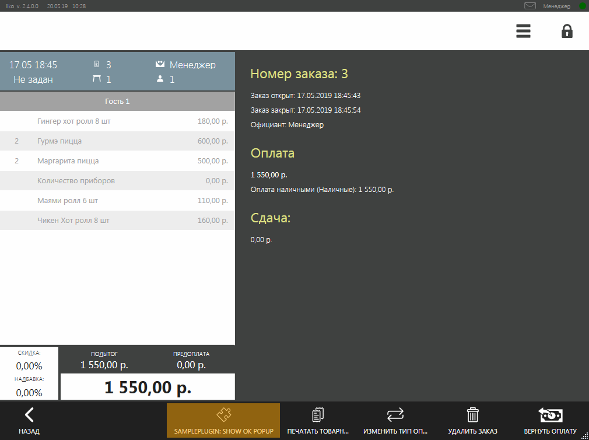
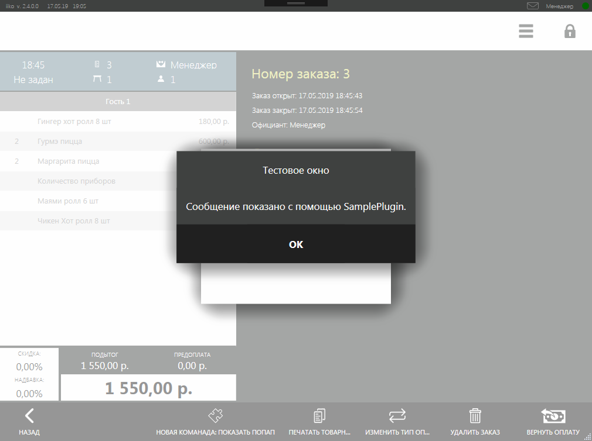
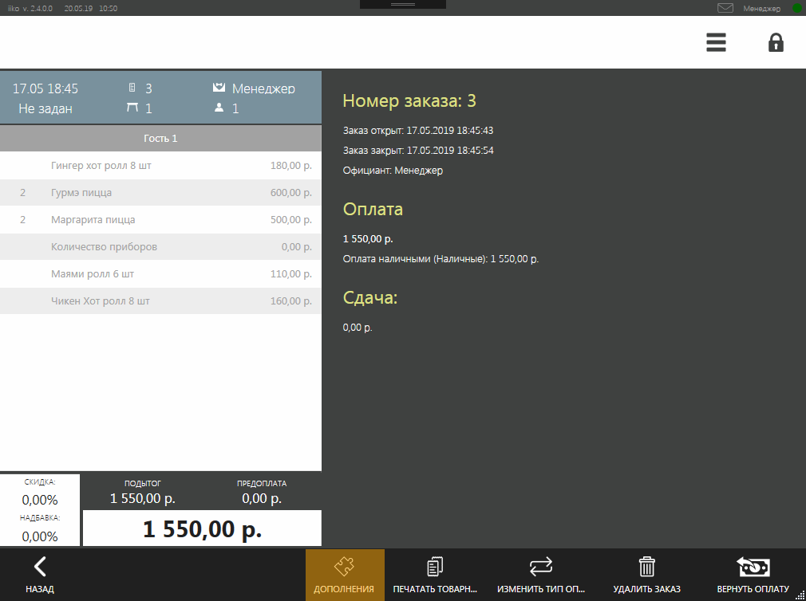
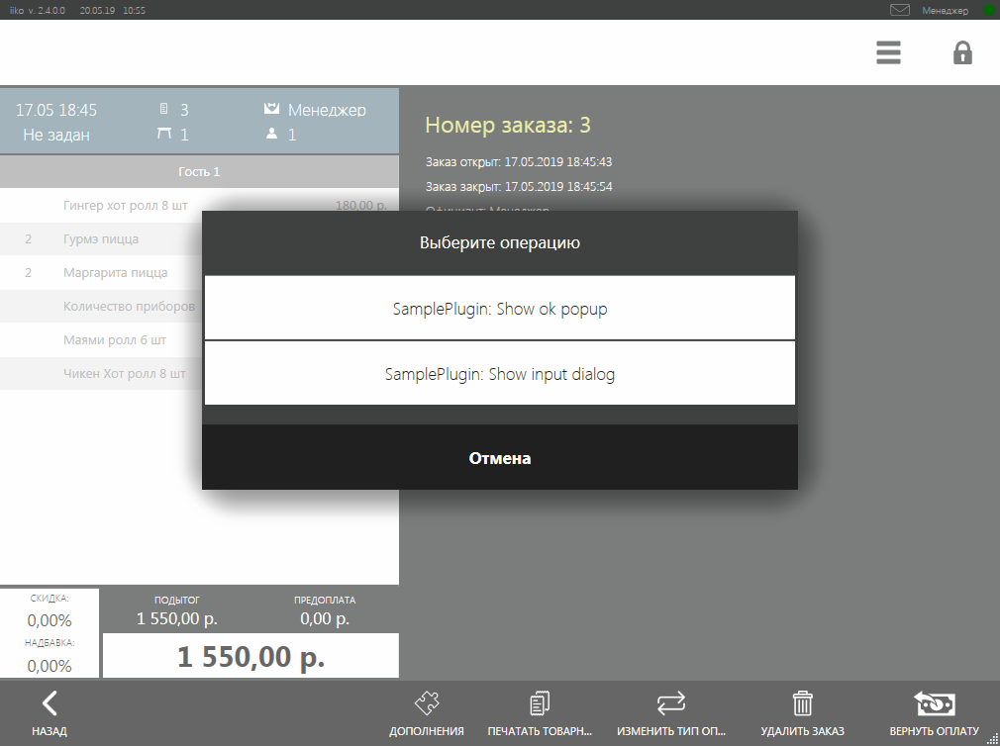
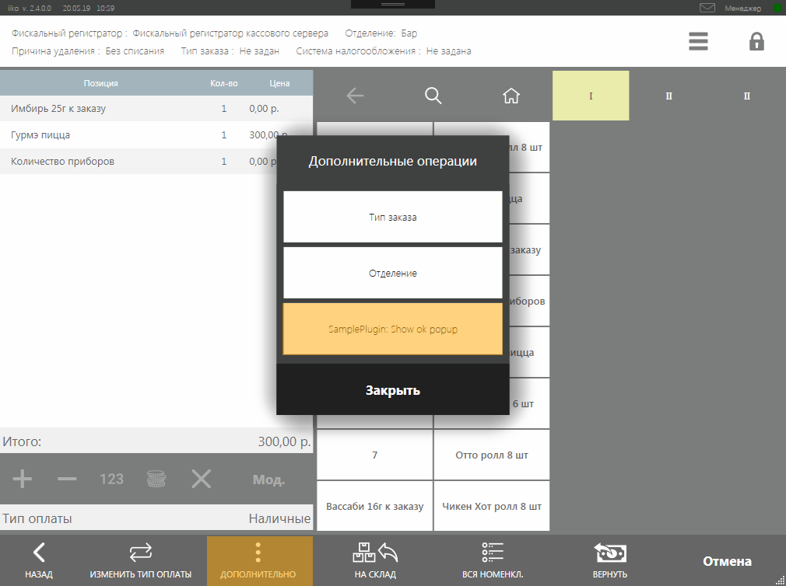

# Расширение функционала экрана закрытого заказа #

## Введение

На экран закрытого заказа текущей кассовой смены и на экран возврата товаров по чеку можно добавить свои команды, которые могут выполнять операции, используя объект закрытого заказа. 

## Как это выглядит в iikoFront?

### 1. На экране закрытого заказа текущей кассовой смены

Для примера, с помощью SDK SamplePlugin была добавлена кнопка с надписью *«SamplePlugin: Show OK popup»*. 
На экране закрытого заказа появляется кнопка с надписью и действием, которую описал плагин.

 

По нажатию на кнопку *«SamplePlugin: Show OK popup»*, описанное плагином действие выполняется.


Допустим плагин просто инициирует показ окна с сообщением на UI iikoFront.

 

Плагин может добавить сразу несколько действий на экран закрытого заказа.


Например, с помощью SDK SamplePlugin были добавлены 2 кнопки: *«SamplePlugin: Show OK popup»* и *«SamplePlugin: Show OK popup»*.
Тогда на экране закрытого заказа появится кнопка *«Дополнения»*.

 

По нажатию на *«Дополнения»* будет выведен список всех расширений, добавленные плагинами. 

 


### 2. На экране возврата товаров с чеком (закрытого заказа прошлой кассовой смены)

См. [документацию](http://ru.iiko.help/articles/iikofront-6-1/topic-38) по возврату товаров с чеком (заказы из прошлых кассовых смен).

 

## Как добавить свои расширения?

##### Шаг 1: Зарегистрировать обработчик для нужного типа экрана закрытого заказа:
 
```cs
subscriptions = new CompositeDisposable
{
	// Регистрация действия на экране закрытого заказа текущей кассовой смены
	Integration.AddButtonOnClosedOrderView("SamplePlugin: Show ok popup", ShowOkPopupOnClosedOrderScreen),
	
	// Регистрация действия на экране закрытого заказа прошлой кассовой смены
	Integration.AddButtonOnPastOrderView("SamplePlugin: Show ok popup", ShowOkPopupOnPastOrderScreen),
};
``` 

Функция регистрации операции на экран закрытого заказа **текущей** кассовой смены [`AddButtonOnClosedOrderView()`](http://iiko.github.io/front.api.sdk/v6/html/M_Resto_Front_Api_V6_Extensions_PluginIntegrationServiceExtensions_AddButtonOnClosedOrderView.htm) принимает на вход 2 аргумента:
- **string** — название кнопки, отображается на UI.
- **action<IOrder, ICashRegisterInfo, IViewManager>** — функция, которая принимает на вход заказ [`IOrder`](http://iiko.github.io/front.api.sdk/v6/html/T_Resto_Front_Api_V6_Data_Orders_IOrder.htm), фискальный регистратор [`ICashRegisterInfo`](http://iiko.github.io/front.api.sdk/v6/html/T_Resto_Front_Api_V6_Data_Device_ICashRegisterInfo.htm) и менеджер окон [`IViewManager`](http://iiko.github.io/front.api.sdk/v6/html/T_Resto_Front_Api_V6_UI_IViewManager.htm).

Функция регистрации операции на экран закрытого заказа **прошлой** кассовой смены [`AddButtonOnPastOrderView()`](http://iiko.github.io/front.api.sdk/v6/html/M_Resto_Front_Api_V6_Extensions_PluginIntegrationServiceExtensions_AddButtonOnPastOrderView.htm) также принимает на вход 2 аргумента:
- **string** — название кнопки, отображается на UI.
- **action<Guid, ICashRegisterInfo, IViewManager>** — функция, которая принимает на вход идентификатор заказа, фискальный регистратор [`ICashRegisterInfo`](http://iiko.github.io/front.api.sdk/v6/html/T_Resto_Front_Api_V6_Data_Device_ICashRegisterInfo.htm) и менеджер окон [`IViewManager`](http://iiko.github.io/front.api.sdk/v6/html/T_Resto_Front_Api_V6_UI_IViewManager.htm).

Заказы закрытых кассовых смен iikoFront не хранит у себя в хранилище, поэтому в методе [`AddButtonOnPastOrderView()`](http://iiko.github.io/front.api.sdk/v6/html/M_Resto_Front_Api_V6_Extensions_PluginIntegrationServiceExtensions_AddButtonOnPastOrderView.htm) по идентификатору заказа не получится получить заказ [`IOrder`](http://iiko.github.io/front.api.sdk/v6/html/T_Resto_Front_Api_V6_Data_Orders_IOrder.htm). 
Идентификатор заказа прошлой кассовой смены будет полезен плагину или внешнему сервису, если он сам ведет свое хранилище.

Подробнее о менеджере окон [`IViewManager`](http://iiko.github.io/front.api.sdk/v6/html/T_Resto_Front_Api_V6_UI_IViewManager.htm) см. статью [*API диалоговые окна*](ViewManager.html "Диалоговые окна").

##### Шаг 2. Описать обработчик добавляемой кнопки:

```cs
private void ShowOkPopupOnClosedOrderScreen(IOrder closedOrder, ICashRegisterInfo cashRegister, IViewManager viewManager)
{
	viewManager.ShowOkPopup("Тестовое окно", "Сообщение показано с помощью SamplePlugin.");
}
```

```cs
private void ShowOkPopupOnPastOrderScreen(Guid pastOrderId, ICashRegisterInfo cashRegister, IViewManager viewManager)
{
	viewManager.ShowOkPopup("Тестовое окно", "Сообщение показано с помощью SamplePlugin.");
}
```
 
Примеры реализации можно посмотреть в проекте SDK SamplePlugin. 