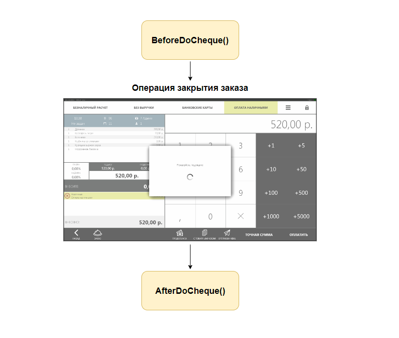
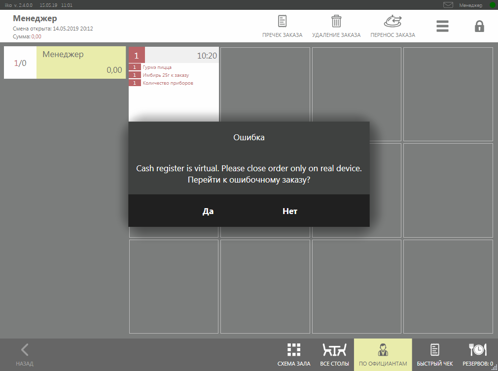
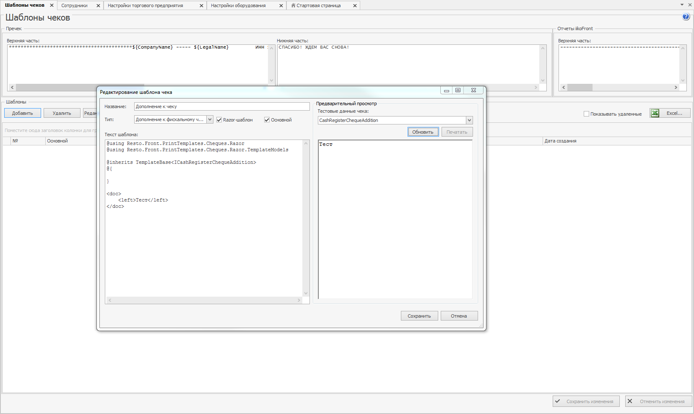

## Введение
 
Команды фискального регистратора могут быть дополнены любыми другими операциями. 
Например, если нужно сделать предварительные работы перед печатью чека оплаты заказа или выполнить операции после печати данного чека.
Схематично, это можно представить так:



Если плагину необходимо получать управление в процессе печати фискального чека оплаты или возврата заказа, а также в процессе внесения, изъятия, печать X и Z отчетов, достаточно реализовать интерфейс [`IChequeTaskProcessor`](http://iiko.github.io/front.api.sdk/v6/html/T_Resto_Front_Api_Devices_ChequeTaskProcessor_IChequeTaskProcessor.htm) и зарегистрировать его посредством вызова метода API [`RegisterChequeTaskProcessor()`](http://iiko.github.io/front.api.sdk/v6/html/M_Resto_Front_Api_IOperationService_RegisterChequeTaskProcessor.htm):
```cs
var chequeTaskProcessor = new ChequeTaskProcessor()
PluginContext.Operations.RegisterChequeTaskProcessor(chequeTaskProcessor);
```

Все команды интерфейса [`IChequeTaskProcessor`](http://iiko.github.io/front.api.sdk/v6/html/T_Resto_Front_Api_Devices_ChequeTaskProcessor_IChequeTaskProcessor.htm) могут прервать выполнение основной операции: фискализация чека, внесение, изъятие, печать X и Z отчета. Для этого в теле команды нужно бросить любого вида исключение.
Например, сделаем условие — нельзя закрывать заказы на виртуальном фискальном регистраторе (ФР):
```cs
public BeforeDoCheckActionResult BeforeDoCheckAction(ChequeTask chequeTask, ICashRegisterInfo device, CashRegisterChequeExtensions chequeExtensions, IViewManager viewManager)
{
	// Для примера: разрешать печатать чеки оплаты и предоплаты только на реальном устройстве.
	if (device.IsVirtual)
		throw new Exception("Cash register is virtual. Please close order only on real device.");

	PluginContext.Log.InfoFormat("Before do cheque on cash register: {0} ({1})", device.FriendlyName, device.Id);
	
	...
}
```
Тогда при оплате заказа на виртуальном ФР iikoFront выведет сообщение об ошибке и заказ останется открытым:



Пример реализации интерфейса [`IChequeTaskProcessor`](http://iiko.github.io/front.api.sdk/v6/html/T_Resto_Front_Api_Devices_ChequeTaskProcessor_IChequeTaskProcessor.htm) и его регистрация есть в проекте SDK SamplePlugin.


## Интерфейс [`IChequeTaskProcessor`](http://iiko.github.io/front.api.sdk/v6/html/T_Resto_Front_Api_Devices_ChequeTaskProcessor_IChequeTaskProcessor.htm)

Рассмотрим подробнее команды [`IChequeTaskProcessor`](http://iiko.github.io/front.api.sdk/v6/html/T_Resto_Front_Api_Devices_ChequeTaskProcessor_IChequeTaskProcessor.htm).


### 1. [`BeforeDoCheckAction`](http://iiko.github.io/front.api.sdk/v6/html/M_Resto_Front_Api_Devices_ChequeTaskProcessor_IChequeTaskProcessor_BeforeDoCheckAction.htm)

[`BeforeDoCheckAction()`](http://iiko.github.io/front.api.sdk/v6/html/M_Resto_Front_Api_Devices_ChequeTaskProcessor_IChequeTaskProcessor_BeforeDoCheckAction.htm) - команда, которая выполняется перед операцией фискализации чека. Это может быть закрытие заказа, возврат заказа, пречек, отмена пречека, возврат товаров. 
Основное ее назначение проверить возможность выполнения операции, а также добавить в чек дополнительную информацию.

##### Как добавить в чек дополнительную информацию?

Есть 2 способа добавить в чек дополнительную информацию:
- Путем добавления шаблона чека «Дополнение к фискальному чеку»: *iikoOffice => «Администрирование» => «Шаблоны чеков» => «Добавить» => «Тип: Дополнение к фискальному чеку»*.
Написанный здесь шаблон будет добавлен в конец чека [`chequeTask.TextAfterCheque`](http://iiko.github.io/front.api.sdk/v6/html/P_Resto_Front_Api_Data_Device_Tasks_BillTask_TextAfterCheque.htm).
Этот способ не связан с расширением функционала ФРа, используя его не нужно регистрировать свой [`IChequeTaskProcessor`](http://iiko.github.io/front.api.sdk/v6/html/T_Resto_Front_Api_Devices_ChequeTaskProcessor_IChequeTaskProcessor.htm).



-  Плагин имеет возможность добавить свои значения в [`chequeTask.TextBeforeCheque`](http://iiko.github.io/front.api.sdk/v6/html/P_Resto_Front_Api_Data_Device_Tasks_BillTask_TextBeforeCheque.htm), [`chequeTask.TextAfterCheque`](http://iiko.github.io/front.api.sdk/v6/html/P_Resto_Front_Api_Data_Device_Tasks_BillTask_TextAfterCheque.htm), а так же изменить имя кассира [`chequeTask.cashierName`](http://iiko.github.io/front.api.sdk/v6/html/P_Resto_Front_Api_Data_Device_Tasks_CashRegisterTask_CashierName.htm). Эти данные будут переданы в ФР для печати. Для этого необходимо заполнить соотвествующие поля в возращаемом значении типа [`BeforeDoCheckActionResult`](http://iiko.github.io/front.api.sdk/v6/html/T_Resto_Front_Api_Data_Device_BeforeDoCheckActionResult.htm). Если модификация полей не требуется, нужно вернуть просто null.
```cs
public BeforeDoCheckActionResult BeforeDoCheckAction(ChequeTask chequeTask, ICashRegisterInfo device, CashRegisterChequeExtensions chequeExtensions, IViewManager viewManager)
{
	var beforeCheque = new List<Data.Print.Document>();
	var documentBefore = new Data.Print.Document();
	documentBefore.Markup.Add(new XElement(Tags.LargeFont, "Welcome"));
	documentBefore.Markup.Add(new XElement(Tags.SmallFont, "tel. 555-123456"));
	beforeCheque.Add(documentBefore);

	var afterCheque = new List<Data.Print.Document>();
	var documentAfter = new Data.Print.Document();
	documentBefore.Markup.Add(new XElement(Tags.SmallFont, "Thank you for shopping"));
	documentBefore.Markup.Add(new XElement(Tags.QRCode, "iiko.ru"));
	beforeCheque.Add(documentAfter);
	
	return new BeforeDoCheckActionResult
	{
		BeforeCheque = beforeCheque,
		AfterCheque = afterCheque,
		CashierName = "CashierName"
	};
}
```

Аргументы функции [`BeforeDoCheckAction()`](http://iiko.github.io/front.api.sdk/v6/html/M_Resto_Front_Api_Devices_ChequeTaskProcessor_IChequeTaskProcessor_BeforeDoCheckAction.htm):
- [`chequeTask`](http://iiko.github.io/front.api.sdk/v6/html/T_Resto_Front_Api_Data_Device_Tasks_ChequeTask.htm) — *информация по заказу*. 
Вся информация по позициям  заказа, скидкам/надбавкам, оплатах и прочее (см. статью [*API внешние фискальные регистраторы*](CashRegisters.html "Внешние фискальные регистраторы")).
- [`device`](http://iiko.github.io/front.api.sdk/v6/html/T_Resto_Front_Api_Data_Device_ICashRegisterInfo.htm) — *информация по фискальному регистратору, на котором происходит закрытие заказа*.
- [`chequeExtensions`](http://iiko.github.io/front.api.sdk/v6/html/T_Resto_Front_Api_Data_Device_CashRegisterChequeExtensions.htm) — *дополнительныя информация по чеку*. 
Хранит разметку для добавления в начало и конец чека ([`chequeExtensions.BeforeCheque`](http://iiko.github.io/front.api.sdk/v6/html/P_Resto_Front_Api_Data_Device_CashRegisterChequeExtensions_BeforeCheque.htm), [`chequeExtensions.AfterCheque`](http://iiko.github.io/front.api.sdk/v6/html/P_Resto_Front_Api_Data_Device_CashRegisterChequeExtensions_AfterCheque.htm)).
Также хранит идентификатор [`chequeExtensions.PastOrderId`](http://iiko.github.io/front.api.sdk/v6/html/P_Resto_Front_Api_Data_Device_CashRegisterChequeExtensions_PastOrderId.htm) и номер [`chequeExtensions.PastOrderNumber`](http://iiko.github.io/front.api.sdk/v6/html/P_Resto_Front_Api_Data_Device_CashRegisterChequeExtensions_PastOrderNumber.htm) заказа, закрытого в прошлой КС.
Эти поля заполняются при возврате заказа из прошлой КС.
- [`viewManager`](http://iiko.github.io/front.api.sdk/v6/html/T_Resto_Front_Api_UI_IViewManager.htm) — *менеджер окон*.
Позволяет показывать предопределённый набор встроенных в iikoFront диалоговых окон (см. статью [*API диалоговые окна*](ViewManager.html "Диалоговые окна")).


### 2. [`AfterDoCheckAction`](http://iiko.github.io/front.api.sdk/v6/html/M_Resto_Front_Api_Devices_ChequeTaskProcessor_IChequeTaskProcessor_AfterDoCheckAction.htm)

[`AfterDoCheckAction()`](http://iiko.github.io/front.api.sdk/v6/html/M_Resto_Front_Api_Devices_ChequeTaskProcessor_IChequeTaskProcessor_AfterDoCheckAction.htm) — команда, которая выполняется после операции фискализации чека. 
Основное ее назначение — выполнить завершающие действия после печати чека. Например, добавить в очередь операцию выгрузки во внешнюю систему.
Аргумент [`result`](http://iiko.github.io/front.api.sdk/v6/html/T_Resto_Front_Api_Data_Device_Results_PostResult.htm) описывает результат выполнения операции на ФР. 
[`result.Success = true`](http://iiko.github.io/front.api.sdk/v6/html/P_Resto_Front_Api_Data_Device_Results_PostResult_Success.htm) — операция выполнена успешно, иначе — неуспех.
Если операция выполнена неуспешно [`result.Success = false`](http://iiko.github.io/front.api.sdk/v6/html/P_Resto_Front_Api_Data_Device_Results_PostResult_Success.htm), текст ошибки можно будет увидеть в [`result.Message`](http://iiko.github.io/front.api.sdk/v6/html/P_Resto_Front_Api_Data_Device_Results_PostResult_Message.htm).


### 3. [`BeforeXReport`](http://iiko.github.io/front.api.sdk/v6/html/M_Resto_Front_Api_Devices_ChequeTaskProcessor_IChequeTaskProcessor_BeforeXReport.htm)

[`BeforeXReport()`](http://iiko.github.io/front.api.sdk/v6/html/M_Resto_Front_Api_Devices_ChequeTaskProcessor_IChequeTaskProcessor_BeforeXReport.htm) — команда, которая выполняется перед печатью X-отчета.
В качестве параметров также передаются фискальный регистратор, на котором проводится операция, [`IViewManager`](http://iiko.github.io/front.api.sdk/v6/html/T_Resto_Front_Api_UI_IViewManager.htm "IViewManager") для показа сообщений или ввода данных и пользователь [`authUser`](http://iiko.github.io/front.api.sdk/v6/html/T_Resto_Front_Api_Data_Security_IUser.htm), инициирующий печать X-отчета. 


### 4. [`AfterXReport`](http://iiko.github.io/front.api.sdk/v6/html/M_Resto_Front_Api_Devices_ChequeTaskProcessor_IChequeTaskProcessor_AfterXReport.htm)

[`AfterXReport()`](http://iiko.github.io/front.api.sdk/v6/html/M_Resto_Front_Api_Devices_ChequeTaskProcessor_IChequeTaskProcessor_AfterXReport.htm) — команда, которая выполняется после печати X-отчета.
Аргументы аналогичны команде [`AfterDoCheckAction`](http://iiko.github.io/front.api.sdk/v6/html/M_Resto_Front_Api_Devices_ChequeTaskProcessor_IChequeTaskProcessor_AfterDoCheckAction.htm).


### 5. [`BeforeZReport`](http://iiko.github.io/front.api.sdk/v6/html/M_Resto_Front_Api_Devices_ChequeTaskProcessor_IChequeTaskProcessor_BeforeZReport.htm)

[`BeforeZReport`](http://iiko.github.io/front.api.sdk/v6/html/M_Resto_Front_Api_Devices_ChequeTaskProcessor_IChequeTaskProcessor_BeforeZReport.htm) — команда, которая выполняется перед печатью Z-отчета.
Параметрами передаются: ФР, пользователь и менеджер окон [`IViewManager`](http://iiko.github.io/front.api.sdk/v6/html/T_Resto_Front_Api_UI_IViewManager.htm "IViewManager").


### 6. [`AfterPayIn`](http://iiko.github.io/front.api.sdk/v6/html/M_Resto_Front_Api_Devices_ChequeTaskProcessor_IChequeTaskProcessor_AfterPayIn.htm)

[`AfterPayIn`](http://iiko.github.io/front.api.sdk/v6/html/M_Resto_Front_Api_Devices_ChequeTaskProcessor_IChequeTaskProcessor_AfterPayIn.htm) — команда, которая выполняется после внесения денежный средств в кассу.
В функцию передаются: ФР, ответ фискального регистратора при выполнении внесения, менеджер окон [`IViewManager`](http://iiko.github.io/front.api.sdk/v6/html/T_Resto_Front_Api_UI_IViewManager.htm "IViewManager") и сумма денежных средств, которую вносили в кассу.


### 7. [`AfterPayOut`](http://iiko.github.io/front.api.sdk/v6/html/M_Resto_Front_Api_Devices_ChequeTaskProcessor_IChequeTaskProcessor_AfterPayOut.htm)

[`AfterPayOut`](http://iiko.github.io/front.api.sdk/v6/html/M_Resto_Front_Api_Devices_ChequeTaskProcessor_IChequeTaskProcessor_AfterPayOut.htm) — команда, которая выполняется после изъятия денежных средств из кассы.
В функцию передаются: ФР, ответ фискального регистратора при выполнении изъятия, менеджер окон [`IViewManager`](http://iiko.github.io/front.api.sdk/v6/html/T_Resto_Front_Api_UI_IViewManager.htm "IViewManager") и сумма денежных средств, которую изымали из кассы.


### Дополнительные интерфейсы [`IReadonlyChequeTaskProcessor`](http://iiko.github.io/front.api.sdk/v6/html/T_Resto_Front_Api_Devices_ChequeTaskProcessor_IReadonlyChequeTaskProcessor.htm) и [`IEditableChequeTaskProcessor`](http://iiko.github.io/front.api.sdk/v6/html/T_Resto_Front_Api_Devices_ChequeTaskProcessor_IEditableChequeTaskProcessor.htm)

Наряду с вышеописанным интерфейсом [`IChequeTaskProcessor`](http://iiko.github.io/front.api.sdk/v6/html/T_Resto_Front_Api_Devices_ChequeTaskProcessor_IChequeTaskProcessor.htm), также есть расширяющие его интерфейсы [`IReadonlyChequeTaskProcessor`](http://iiko.github.io/front.api.sdk/v6/html/T_Resto_Front_Api_Devices_ChequeTaskProcessor_IReadonlyChequeTaskProcessor.htm) и [`IEditableChequeTaskProcessor`](http://iiko.github.io/front.api.sdk/v6/html/T_Resto_Front_Api_Devices_ChequeTaskProcessor_IEditableChequeTaskProcessor.htm), которые позволяют выполнять свои задачи перед выполнением внесения и изъятия на кассе.


Регистрируются они точно также, как родительский интерфейс.
Разница между ними лишь в том, что используя интерфейс [`IReadonlyChequeTaskProcessor`](http://iiko.github.io/front.api.sdk/v6/html/T_Resto_Front_Api_Devices_ChequeTaskProcessor_IReadonlyChequeTaskProcessor.htm) плагин при изъятии денежных средств не может отредактировать сумму изъятия, а используя интерфейс [`IEditableChequeTaskProcessor`](http://iiko.github.io/front.api.sdk/v6/html/T_Resto_Front_Api_Devices_ChequeTaskProcessor_IEditableChequeTaskProcessor.htm) — может, за счет параметра [`ref estimatedSum`](http://iiko.github.io/front.api.sdk/v6/html/M_Resto_Front_Api_Devices_ChequeTaskProcessor_IEditableChequeTaskProcessor_BeforePayOutSessionClosed.htm).
Это сделано для того, чтобы при закрытии КС плагин мог регулировать сумму изъятия.
