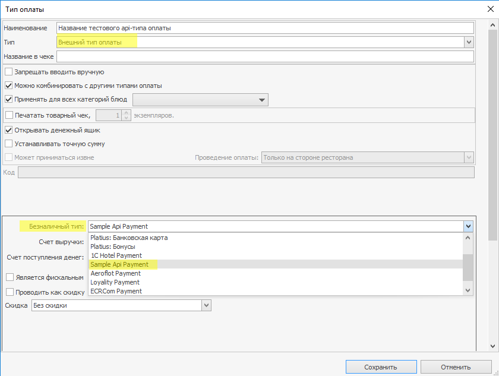
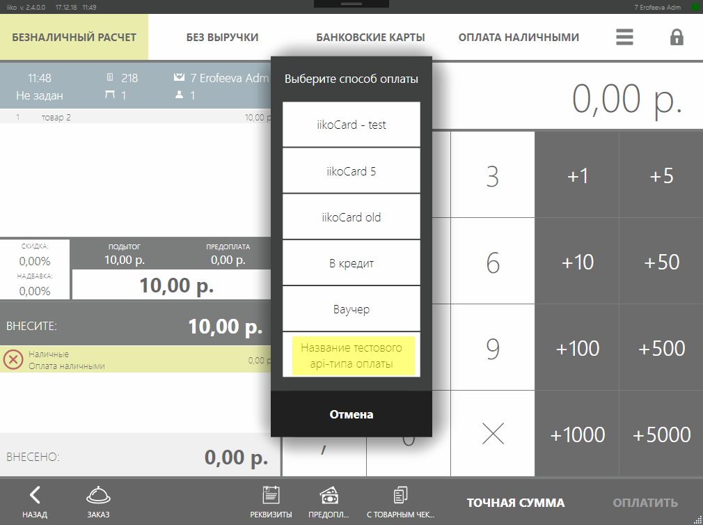

# Интеграция с внешними типами оплаты
## Общая идея 
Реализовав интерфейс [`IExternalPaymentProcessor`](http://iiko.github.io/front.api.sdk/v6/html/T_Resto_Front_Api_V6_IExternalPaymentProcessor.htm) и зарегистрировав его соответствующим образом, в системе iiko появится система оплаты кастомной логикой проведения и возврата оплаты. 
Для плагинов, реализующих внешние типы оплаты, вводится [обязательное лицензирование](https://ru.iiko.help/articles/#!api-documentations/apistart).


## Регистрация внешней системы оплаты

Плагин регистрирует платёжную систему с помощью [`IOperationService.RegisterPaymentSystem(...)`](http://iiko.github.io/front.api.sdk/v6/html/M_Resto_Front_Api_V6_IOperationService_RegisterPaymentSystem.htm)
```cs
var disposable = PluginContext.Operations.RegisterPaymentSystem(paymentSystem);
```
Где 
`paymentSystem` – экземпляр класса, реализующего `IExternalPaymentProcessor`.
В результате регистрации оплатного плагина в iikoOffice появится новая система оплаты в разделе «Внешний тип оплаты» с `IExternalPaymentProcessor.PaymentSystemName`.




Если создать [тип оплаты](https://ru.iiko.help/articles/iikooffice-5-4/topic-103) этой системы оплаты, на iikoFront на экране кассы добавится возможность выбрать этот тип оплаты.



Пояснения к терминам:

- *Система оплаты* – декларирует, как именно осуществлять проведение и возврат платежей. На всю систему iiko система оплаты декларируется в единственном экземпляре. 
- *Тип оплаты* - относится к какой-либо системе оплаты. Имеет настраиваемые свойства вроде фискальности, счетов перемещения и т.д. Если сделать API-тип оплаты фискальным, он попадёт в раздел *«Банковские карты»*, если оставить нефискальным, он будет в разделе *«Безналичный расчёт»*. Можно заводить сколько угодно типов оплаты каждой системы оплаты.   
- *Элемент оплаты (оплатный айтем)* – то, что относится к заказам в системе iiko. Когда пользователь [на экране кассы](https://ru.iiko.help/articles/#!iikofront-5-4/topic-72), [предоплат и платежей](https://ru.iiko.help/articles/#!iikofront-5-4/topic-72/a/h2_10), выбирает какой-либо тип оплаты, в заказ помещается элемент оплаты соответствующего типа. Также элементы оплаты могут быть добавлены средствами API. *(NOTE: добавить ссылку, когда про это будет написана статья)*  

 
## Интерфейс IExternalPaymentProcessor
Чтобы реализовать логику по проведению и распроведению платежа внешним типом нужно реализовать интерфейс [`IExternalPaymentProcessor`](http://iiko.github.io/front.api.sdk/v6/html/T_Resto_Front_Api_V6_IExternalPaymentProcessor.htm)
```cs
public interface IExternalPaymentProcessor
{
    string PaymentSystemKey { get; }
    string PaymentSystemName { get; }
    
    void CollectData(Guid orderId, Guid paymentTypeId, [NotNull] IUser cashier, IReceiptPrinter printer, UI.IViewManager viewManager, IPaymentDataContext context, UI.IProgressBar progressBar);
    void OnPaymentAdded([NotNull] IOrder order, [NotNull] IPaymentItem paymentItem, [NotNull] IUser cashier, [NotNull] IOperationService operationService, IReceiptPrinter printer, UI.IViewManager viewManager, IPaymentDataContext context, UI.IProgressBar progressBar);
    bool OnPreliminaryPaymentEditing([NotNull] IOrder order, [NotNull] IPaymentItem paymentItem, [NotNull] IUser cashier, [NotNull] IOperationService operationService, IReceiptPrinter printer, UI.IViewManager viewManager, IPaymentDataContext context, UI.IProgressBar progressBar);

    void Pay(decimal sum, Guid? orderId, Guid paymentTypeId, Guid transactionId, [NotNull] IPointOfSale pointOfSale, [NotNull] IUser cashier, IReceiptPrinter printer, IViewManager viewManager, IPaymentDataContext context, IProgressBar progressBar);
    void EmergencyCancelPayment(decimal sum, Guid? orderId, Guid paymentTypeId, Guid transactionId, [NotNull] IPointOfSale pointOfSale, [NotNull] IUser cashier, IReceiptPrinter printer, IViewManager viewManager, IPaymentDataContext context, IProgressBar progressBar);
    void ReturnPayment(decimal sum, Guid? orderId, Guid paymentTypeId, Guid transactionId, [NotNull] IPointOfSale pointOfSale, [NotNull] IUser cashier, IReceiptPrinter printer, IViewManager viewManager, IPaymentDataContext context, IProgressBar progressBar);
    void ReturnPaymentWithoutOrder(decimal sum, Guid paymentTypeId, [NotNull] IPointOfSale pointOfSale, [NotNull] IUser cashier, IReceiptPrinter printer, IViewManager viewManager, IProgressBar progressBar);
}
```

Здесь:

- `PaymentSystemKey` это уникальный ключ, с которым регистрируется новая внешняя система оплаты
- `PaymentSystemName` имя, которое будет показываться на UI в BackOffice


## Метод проведения оплаты

Когда пользователь iikoFront выберет на экране кассы тип оплаты, задаст сумму и нажмёт кнопку *«Оплатить»*  или когда пользователь вносит предоплату определенным типом оплаты, управление приходит в метод [`Pay`](http://iiko.github.io/front.api.sdk/v6/html/M_Resto_Front_Api_V6_IExternalPaymentProcessor_Pay.htm)
```cs
void Pay(decimal sum, Guid? orderId, Guid paymentTypeId, Guid transactionId, [NotNull] IPointOfSale pointOfSale, [NotNull] IUser cashier, IReceiptPrinter printer, IViewManager viewManager, IPaymentDataContext context, IProgressBar progressBar);
```

Здесь:

- `sum` – сумма платежа
- `orderId` – id заказа в системе iiko
- `paymentTypeId` – id типа оплаты в системе iiko. Список всех типов оплаты в системе iiko можно получить методом [`IOperationService.GetPaymentTypes()`](http://iiko.github.io/front.api.sdk/v6/html/M_Resto_Front_Api_V6_IOperationService_GetPaymentTypes.htm), конктетный тип оплаты можно поулчить методом [`OperationService_TryGetPaymentTypeById(...)`](http://iiko.github.io/front.api.sdk/v6/html/M_Resto_Front_Api_V6_IOperationService_TryGetPaymentTypeById.htm)
- `transactionId` – id транзакции в системе iiko
- `pointOfSale` – [Точка продаж](GroupsAndPointsOfSale.html), на которой проводится данный элемент оплаты
- `cashier` – кассир
- `printer` – экземпляр [`IReceiptPrinter`](http://iiko.github.io/front.api.sdk/v6/html/T_Resto_Front_Api_V6_IReceiptPrinter.htm), который дает возможность печати на принтере квитанций iikoFront
- `viewManager` – экземпляр [IViewManager](http://iiko.github.io/front.api.sdk/v6/html/T_Resto_Front_Api_V6_UI_IViewManager.htm) для [показа окон](ViewManager.html) в процессе оплаты. 
- `context` – экземпляр [`IPaymentDataContext`](http://iiko.github.io/front.api.sdk/v6/html/T_Resto_Front_Api_V6_IPaymentDataContext.htm) для сохранения данных в оплатный айтем.
- `progressBar` – хэлпер-класс сохранения данных в оплатный айтем. 

Подробнее сигнатуру объектов можно найти [в документации](http://iiko.github.io/front.api.sdk/v6).

Например, если требуется реализовать интеграцию с гостиничной системой:

- В процессе оплаты нужно спросить у пользователя номер комнаты или карту от номера
- Затем обратится к гостиничному сервису
- В случае успеха напечатать квитанцию с суммой и именем гостя, которое нам вернет гостиничная система
- В iikoRMS сохранить введенный номер или прокатанную карту для просмотра этих данных в OLAP
- Для последующей отмены нам понадобится знать, карта ли была прокатана или введен номер.
- В случае неуспеха  прервать оплату, то это будет выглядеть так:

```cs
[Serializable]
internal class IsCardClass
{
	public bool IsCard;
}
public void Pay(decimal sum, Guid? orderId, Guid paymentTypeId, Guid transactionId, IPointOfSale pointOfSale,  IUser cashier, IReceiptPrinter printer, IViewManager viewManager, IPaymentDataContext context, IProgressBar progressBar)
{
	// Показать в iikoFront окно ввода номера и прокатки карты
	var input = viewManager.ShowInputDialog("Введите номер или прокатайте карту", InputDialogTypes.Card | InputDialogTypes.Number);
	string room = null;
	string cardTrack = null;

	// Если был введен номер, то результат типа INumberInputResult
	var roomNum = input as NumberInputDialogResult;
	if (roomNum != null)
		room = roomNum.Number.ToString();

	// Если была прокатана карта, то результат типа ICardInputResult
	var card = input as CardInputDialogResult;
	if (card != null)
		cardTrack = card.FullCardTrack;

	if (room == null && cardTrack == null)
		// Ничего не было введено, прекращаем операцию.
		throw new PaymentActionFailedException("Не было введено данных.");

	// Получаем заказ средствами API по id через operationService.
	var order = PluginContext.Operations.TryGetOrderById(orderId.Value);

	// Выполняем произвольные методы. Например, процессим платеж в некой hotelSystem, которая вернет имя гостя, если платеж «принят» и пустую строку, если платеж отклонён.
	var guestName = hotelSystem.ProcessPaymentOnGuest(cardTrack, room, order?.Number, transactionId, sum);
	if (guestName.IsNullOrEmpty())
		// Платеж не прошёл, прекращаем операцию.
		throw new PaymentActionFailedException("Платеж не прошёл.");

	// Формирование квитанции для печати. Квитанция состоит из наследников XElement из библиотеки Resto.CashServer.Agent.Print.Tags.Xml (Resto.Framework.dll)
	var slip = new ReceiptSlip
	{
		Doc =  new XElement(Tags.Doc, 
			new XElement(Tags.Pair, "Гость", guestName),
			new XElement(Tags.Pair, "Сумма", sum))
	};

	// Печать.
	printer.Print(slip);
	var cardInfoData = new IsCardClass { IsCard = card != null };
	var cardType = cardInfoData.IsCard
		? "My Hotel System Card"
		: "My Hotel System Room";
	// Сохранение данных, которые будут показаны в отчётах.
	context.SetInfoForReports(room ?? cardTrack, cardType);
	// Сохранение данных, которые будут использованы для возврата оплаты.
	context.SetRollbackData(cardInfoData);
}
```
 
Исключение типа [`PaymentActionFailedException`](http://iiko.github.io/front.api.sdk/v6/html/T_Resto_Front_Api_V6_Exceptions_PaymentActionFailedException.htm) служит для прерывания операции оплаты и возвращения неуспешного результата. Пользователю в UI iikoFront будет показан `message` этого исключения. Это имеет смысл, если возникли какие-то проблемы при общении с внешним сервисом, оплата не может быть проведена и нужно проинформировать пользователя о причинах. 

Для «тихого» прерывания операции можно поспользоваться исключением типа [`PaymentActionCancelledException`](http://iiko.github.io/front.api.sdk/v6/html/T_Resto_Front_Api_V6_Exceptions_PaymentActionCancelledException.htm). Это имеет смысл, если в показанном в процессе оплаты диалоговом окне нажал кнопку «Отмена». 

Объекты типов [`IReceiptPrinter`](http://iiko.github.io/front.api.sdk/v6/html/T_Resto_Front_Api_V6_IReceiptPrinter.htm), [IViewManager](http://iiko.github.io/front.api.sdk/v6/html/T_Resto_Front_Api_V6_UI_IViewManager.htm) и  [`IPaymentDataContext`](http://iiko.github.io/front.api.sdk/v6/html/T_Resto_Front_Api_V6_IPaymentDataContext.htm) «живут» только в процессе выполнения метода, после завершения метода они уничтожаются. Так что сохранять их в переменные не имеет смысла, т.к. вне метода их нельзя будет использовать.


## Методы возврата оплаты

```cs
void EmergencyCancelPayment(decimal sum, Guid? orderId, Guid paymentTypeId, Guid transactionId, [NotNull] IPointOfSale pointOfSale, [NotNull] IUser cashier, IReceiptPrinter printer, IViewManager viewManager, IPaymentDataContext context, IProgressBar progressBar);
void ReturnPayment(decimal sum, Guid? orderId, Guid paymentTypeId, Guid transactionId, [NotNull] IPointOfSale pointOfSale, [NotNull] IUser cashier, IReceiptPrinter printer, IViewManager viewManager, IPaymentDataContext context, IProgressBar progressBar);
void ReturnPaymentWithoutOrder(decimal sum, Guid paymentTypeId, [NotNull] IPointOfSale pointOfSale, [NotNull] IUser cashier, IReceiptPrinter printer, IViewManager viewManager, IProgressBar progressBar);
```

Методы `EmergencyCancelPayment` и `ReturnPayment` вызываются, когда пользователь на iikoFront инициирует распроведение платежа.

В метод `ReturnPayment` управление передается, когда на экране закрытого заказа нажимают кнопку «Частичный возврат чека» или «Удаление заказа». Или если пользователь удаляет проведенную предоплату. В метод `EmergencyCancelPayment` управление передается, когда для ещё не закрытого заказа отменяют уже проведенную оплату. Например, если оплата фискальная и возникли трудности с печатью фискального чека и оплату прерывают.
Если для второго случая не требуется специфической логики, то можно просто вызвать из метода `EmergencyCancelPayment` метод `ReturnPayment`. 

Методы принимают те же параметры, что и метод оплаты. `transactionId` тот же, что передавался в исполненную ранее операцию `Pay`.

Метод считается успешно завершенным, если в процессе выполнения не возникло исключений типа `PaymentActionFailedException` или `PaymentActionCancelledException`. Если это исключения возникло, так же, как и для оплаты, операция возврата прерывается.

Пример кода интеграции с гостиничной системой, метод возврата отменяет транзакцию и печатает чек с отменяемой суммой и сохраненными данными о том, была ли прокатана карта, или был введен номер.

```cs
[Serializable]
public class IsCardClass
{
	public bool IsCard;
}

public void ReturnPayment(decimal sum, Guid? orderId, Guid paymentTypeId, Guid transactionId, [NotNull] IPointOfSale pointOfSale, [NotNull] IUser cashier, IReceiptPrinter printer, IViewManager viewManager, IPaymentDataContext context, IProgressBar progressBar)
{
	// Выполняем произвольные методы. Например, возвращает платеж по id транзакции платеж в некой hotelSystem, которая вернет true, если платеж успешно откатился и false, если возврат не удался.
	var success = hotelSystem.ProcessReturnPayment(transactionId);
	if (!success)
		throw new PaymentActionFailedException("Не получилось вернуть оплату.");

	// Получаем данные, сохраненные в оплатном айтеме.
	var isCard = context.GetRollbackData<IsCardClass>();

	var slip = new ReceiptSlip
	{
		Doc =  new XElement(Tags.Doc, 
			new XElement(Tags.Pair, "Возврат суммы", sum),
			new XElement(Tags.Pair, "Была ли карта", isCard.IsCard ? "ДА" : "НЕТ" ))
	};
	printer.Print(slip);
}

public void EmergencyCancelPayment(decimal sum, Guid? orderId, Guid paymentTypeId, Guid transactionId, [NotNull] IPointOfSale pointOfSale, [NotNull] IUser cashier, IReceiptPrinter printer,
	IViewManager viewManager, IPaymentDataContext context, IProgressBar progressBar)
{
	ReturnPayment(sum, orderId, paymentTypeId, transactionId, pointOfSale, cashier, printer, viewManager, context, progressBar);
}
```

Метод [`ReturnPaymentWithoutOrder`](https://iiko.github.io/front.api.sdk/v6/html/M_Resto_Front_Api_V6_IExternalPaymentProcessor_ReturnPaymentWithoutOrder.htm) вызывается, когда происходит [возврат товаров](https://ru.iiko.help/articles/iikofront-6-1/topic-38) API-типом оплаты.
Возможность возвращать оплату за товары без оплченных ранее заказов API-типами появилась начиная с версии iiko 6.2.2. 
Чтобы на UI возврата товаров появилась возможность выбрать API-тип оплаты, нужно регистрировать процессор оплаты с опциональным параметром `canProcessPaymentReturnWithoutOrder = true`. Т.е.

```cs
var disposable = PluginContext.Operations.RegisterPaymentSystem(paymentSystem, true);
```

В отличие от всех упомянутых выше методов, данный метод не имеет контекста заказа и проведенной ранее оплаты. Предполагается, что суммы и типа оплаты достаточно для выполнения возврата. В процессе данной операции доступна возможность показывать пользователю диалоговые окна и печатать квитанции, так же, как и для всех упомянутых выше методов. 

## Методы сбора данных

```cs
void CollectData(Guid orderId, Guid paymentTypeId, [NotNull] IUser cashier, IReceiptPrinter printer, UI.IViewManager viewManager, IPaymentDataContext context, UI.IProgressBar progressBar);
void OnPaymentAdded([NotNull] IOrder order, [NotNull] IPaymentItem paymentItem, [NotNull] IUser cashier, [NotNull] IOperationService operationService, IReceiptPrinter printer, UI.IViewManager viewManager, IPaymentDataContext context, UI.IProgressBar progressBar);
bool OnPreliminaryPaymentEditing([NotNull] IOrder order, [NotNull] IPaymentItem paymentItem, [NotNull] IUser cashier, [NotNull] IOperationService operationService, IReceiptPrinter printer, UI.IViewManager viewManager, IPaymentDataContext context, UI.IProgressBar progressBar);
```

Если требуется собрать какие-либо данные не в момент нажатия на кнопку *«Оплатить»* на экране кассы, а в момент выбора API-типа оплаты, то можно реализовать это в методе `CollectData`. Операцию по сбору данных и добавление элемента оплаты можно также 

Метод `OnPaymentAdded` вызывается после добавления элемента оплаты в заказ. Особенность этого метода в том, что одним из его аргументов является `IOperationService operationService`. В отличие от [`PluginContext.Operations`](https://iiko.github.io/front.api.sdk/v6/html/P_Resto_Front_Api_V6_PluginContext_Operations.htm), у данного экземпляра есть полномочия вносить изменения в текущий заказ. Это нужно, например, чтобы задать сумму для добавляемого элемента оплаты или вообще добавить какое-либо блюдо в заказ.
 
Метод `OnPreliminaryPaymentEditing` вызывается при редактировании предварительных платежей. Для данного метода также доступна возможность вносить изменения в текущий заказ через аргумент `IOperationService operationService`.
Метод возвращает `bool`, смысл возвращаемого значения следующий: доступно ли изменение суммы элемента предварительной оплаты с UI после совершения данного метода. 

## Открытие и закрытие кассовой смены в iikoFront.

Некоторым внешним платежным системам при открытии и закрытии кассовой смены в iiko нужно выполнять на своей стороне действия. Например, для банковских систем при закрытии смены нужно проводить сверку.
Для этого нужно подписаться на [`INotificationService._SubscribeOnCafeSessionOpening`](https://iiko.github.io/front.api.sdk/v6/html/M_Resto_Front_Api_V6_INotificationService_SubscribeOnCafeSessionOpening.htm) и [`INotificationService.SubscribeOnCafeSessionClosing`](https://iiko.github.io/front.api.sdk/v6/html/M_Resto_Front_Api_V6_INotificationService_SubscribeOnCafeSessionClosing.htm) 

При открытии и закрытии кассовой смены в соответствующий observer приходит новое событие.
Пример кода, который при открытии и закрытии смены печатает на принтере ключ платежной системы и открыта или закрыта смена.


```cs
ctor
{
    // ...   
    PluginContext.Notifications.SubscribeOnCafeSessionClosing(CafeSessionClosing);
    PluginContext.Notifications.SubscribeOnCafeSessionOpening(CafeSessionOpening)                
}

private void CafeSessionOpening([NotNull] IReceiptPrinter printer, [NotNull] IProgressBar progressBar)
{
	PluginContext.Log.Info("Cafe Session Opening.");
	var message =
		"Я не могу подключиться к своему серверу и открыть смену.";
	PluginContext.Operations.AddNotificationMessage(message, "SamplePaymentPlugin");
}

private void CafeSessionClosing([NotNull] IReceiptPrinter printer, [NotNull] IProgressBar progressBar)
{
	PluginContext.Log.Info("Cafe Session Closing.");
	var slip = new ReceiptSlip
	{
		Doc = new XElement(Tags.Doc,
			new XElement(Tags.Center, PaymentSystemKey),
			new XElement(Tags.Center, "Cafe session closed."))
	};
	printer.Print(slip);
}

```

Исключения, возникшие в процессе выполнения `CafeSessionOpening` и `CafeSessionClosing`, не прерывают операций открытия и закрытия смены на iikoFront. Если необходимо показать пользователю какое-либо предупреждение, можно сделать это с помощью уведомлений в левом верхнем углу iikoFront. 
