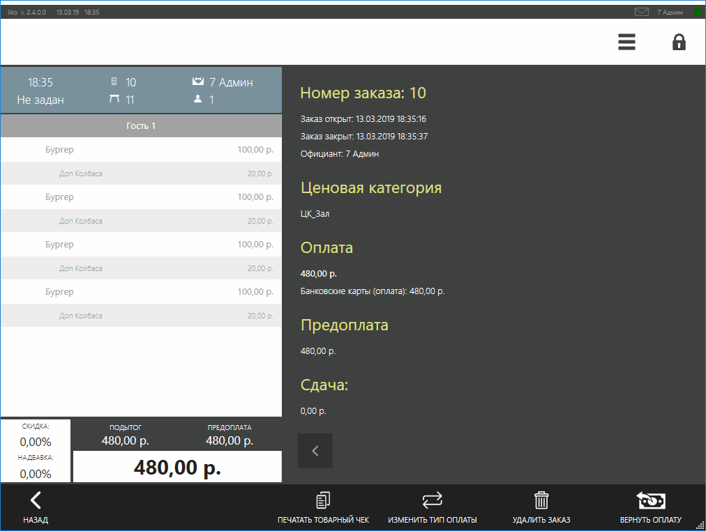
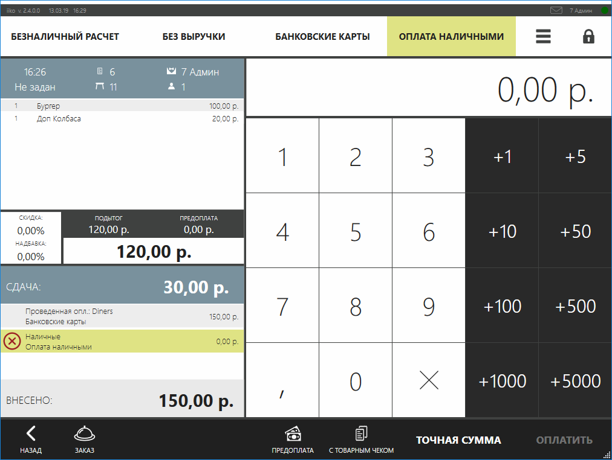
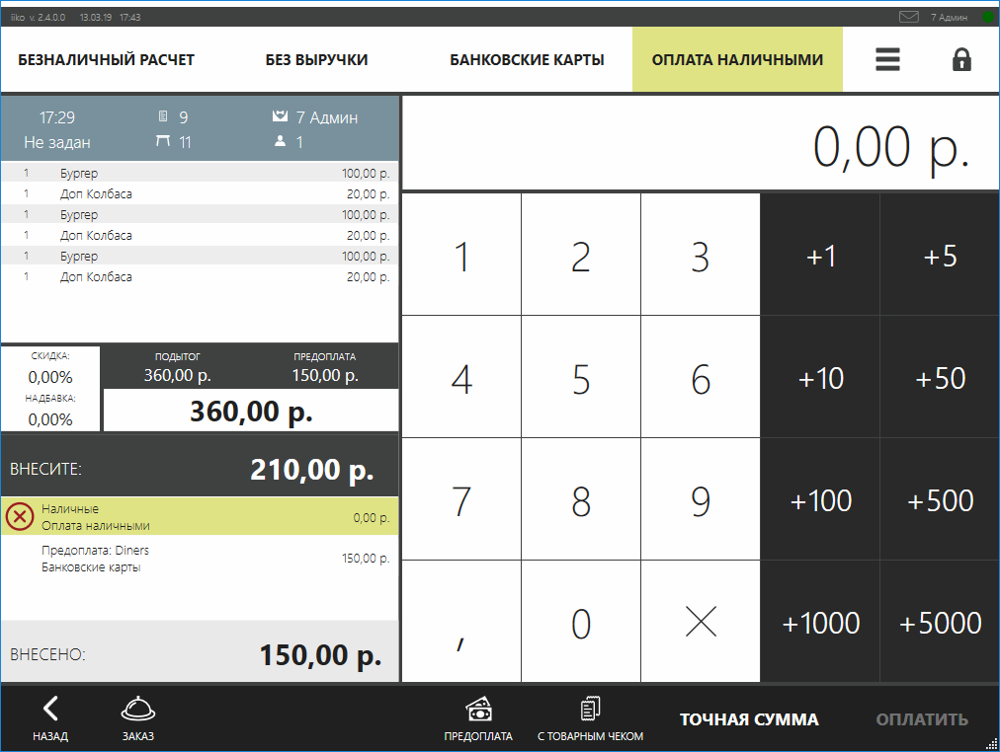
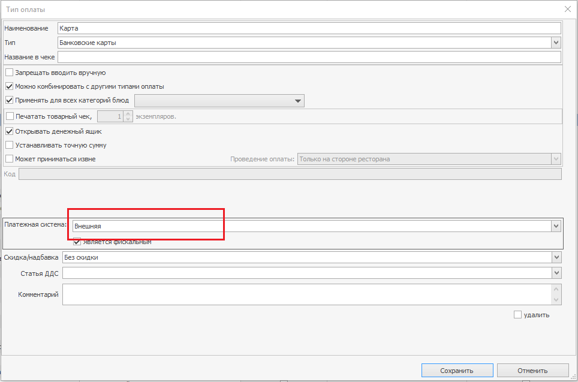

## Добавление оплат
Для добавления оплаты в заказ существуют методы:

- [IEditSession.AddPaymentItem](https://iiko.github.io/front.api.sdk/v6/html/Overload_Resto_Front_Api_Editors_IEditSession_AddPaymentItem.htm) &mdash; добавить оплату

- [IEditSession.AddExternalPaymentItem](https://iiko.github.io/front.api.sdk/v6/html/Overload_Resto_Front_Api_Editors_IEditSession_AddExternalPaymentItem.htm) &mdash; добавить внешнюю оплату

- [IEditSession.AddPreliminaryPaymentItem](https://iiko.github.io/front.api.sdk/v6/html/Overload_Resto_Front_Api_Editors_IEditSession_AddPreliminaryPaymentItem.htm) &mdash; добавить предварительную оплату _(имеет смысл только для заказов доставки)_

- [IEditSession.AddExternalFiscalizedPaymentItem](https://iiko.github.io/front.api.sdk/v7/html/Overload_Resto_Front_Api_Editors_IEditSession_AddExternalFiscalizedPaymentItem.htm) &mdash; добавить оплату, фискализованную на внешней кассе вне iikoFront _(NOTE: данный функционал доступен только начиная с V7Preview4)_

Также можно использовать одноименные [методы](https://iiko.github.io/front.api.sdk/v6/html/Methods_T_Resto_Front_Api_Extensions_OperationServiceExtensions.htm) сервиса операций&ndash;расширений, в которых неявно создаётся [сессия редактирования]({{ site.baseurl }}/v6/ru/Data%20editing.html)
(_отличие в необходимости выполнения нескольких действий над заказом.
Если помимо добавления оплаты требуется, например, добавить гостя к заказу, то нужно использовать методы в рамках сессии редактирования_).
Для настройки и регистрации внешних типов оплаты см. статью [Интеграция с внешними типами оплаты](PaymentProcessor.html).

##### Ограничения добавления оплат:
Платеж может быть добавлен в заказ, только если заказ находится в статусе новый (`New`) или пречек (`Bill`), иначе метод выбрасывает исключение [`ConstraintViolationException`](http://iiko.github.io/front.api.sdk/v6/html/T_Resto_Front_Api_Exceptions_ConstraintViolationException.htm).
Кроме того нельзя добавить в заказ несколько непроведенных элементов оплаты одного типа
(_NOTE: планируется разрешить добавлять несколько непроведенных элементов оплаты в заказ_).

##### Примеры

- Добавление в заказ оплаты наличными
```cs
var order = PluginContext.Operations.GetOrders().Last(o => o.Status == OrderStatus.New);
var paymentType = PluginContext.Operations.GetPaymentTypes().Last(x => x.Kind == PaymentTypeKind.Cash);
var credentials = PluginContext.Operations.GetCredentials();
var paymentItem = PluginContext.Operations.AddPaymentItem(100m, null, paymentType, order);
```
- Добавление в доставочный заказ оплаты картой
```cs
var deliveryOrder = PluginContext.Operations.GetDeliveryOrders().Last(o => o.Status == OrderStatus.New);
var paymentType = PluginContext.Operations.GetPaymentTypes().Last(x => x.Kind == PaymentTypeKind.Card && x.Name.ToUpper() == "DINERS");
var additionalData = new CardPaymentItemAdditionalData { CardNumber = "123456" };
PluginContext.Operations.AddPreliminaryPaymentItem(150, additionalData, paymentType, deliveryOrder, PluginContext.Operations.GetCredentials());
```
- Добавить в заказ внешнюю непроведенную оплату
```cs
var order = PluginContext.Operations.GetOrders().Last(o => o.Status == OrderStatus.New);
var paymentType = PluginContext.Operations.GetPaymentTypes().Last(x => x.Kind == PaymentTypeKind.Card && x.Name.ToUpper() == "DINERS");
var additionalData = new CardPaymentItemAdditionalData { CardNumber = "123456" };
PluginContext.Operations.AddExternalPaymentItem(150, false, additionalData, paymentType, order, PluginContext.Operations.GetCredentials());
```


- Добавить в заказ оплату, фискализованную на внешней кассе
```cs
var order = PluginContext.Operations.GetOrders().Last(o => (o.Status == OrderStatus.New));
var paymentType = PluginContext.Operations.GetPaymentTypes().Last(x => x.Kind == PaymentTypeKind.Card && x.Name.ToUpper() == "DINERS");
var additionalData = new CardPaymentItemAdditionalData { CardNumber = "123456" };
var credentials = PluginContext.Operations.GetCredentials();
PluginContext.Operations.AddExternalFiscalizedPaymentItem(50, additionalData, paymentType, order, credentials);
```

Комментарии:
- В примерах используется выражение `PluginContext.Operations.GetOrders().Last(...)` &mdash; получение последнего попавшегося заказа из списка.
Для решения бизнес&ndash;задач следует использовать соответствующий критерий отбора.
- `PluginContext.Operations.GetCredentials()` &mdash; здесь и далее в примерах приводится метод&ndash;расширение, [реализованный](https://github.com/iiko/front.api.sdk/blob/master/sample/v6/Resto.Front.Api.SamplePlugin/OperationServiceExtensions.cs) в примере проекта SamplePlugin.

## Оплата заказа
Для оплаты заказа существуют методы:

- [IOperationService.PayOrder](https://iiko.github.io/front.api.sdk/v6/html/M_Resto_Front_Api_IOperationService_PayOrder.htm) &mdash; оплата заказа

- [IOperationService.PayOrderAndPayOutOnUser](https://iiko.github.io/front.api.sdk/v6/html/M_Resto_Front_Api_IOperationService_PayOrderAndPayOutOnUser.htm) &mdash; оплата заказа в расчет официанту

также существует метод, с помощью которого можно превратить элемент оплаты в предоплату iikoFront
- [IOperationService.ProcessPrepay](https://iiko.github.io/front.api.sdk/v6/html/M_Resto_Front_Api_IOperationService_ProcessPrepay.htm)

 Если оплата производится фискальным наличным типом, то на пользователя, от чьего имени производится операция оплаты методом `IOperationService.PayOrderAndPayOutOnUser`, будет оформлено [фискальное изъятие](https://ru.iiko.help/articles/iikofront-6-3/topic-43).

#### Примеры

##### Оплата заказа, в котором достаточно внесенных денежных средств

Пусть существует заказ IOrder order, который необходимо закрыть в iikoFront и в заказ уже внесено достаточно проведенных оплат
(*проведенные элементы оплаты это либо предоплаты, внесенные на экране кассы iikoFront, либо оплаты, добавленные по инициативе плагина методом `AddExternalPaymentItem` с флагом `isProcessed` равным `true`*).
Для такого заказа можно вызвать метод:
```cs
operationService.PayOrder(credentials, order);
```



##### Оплата заказа наличными с расчетом официанту

Пусть существует заказ `IOrder order`, который необходимо оплатить наличными на всю сумму заказа и закрыть в iikoFront.
Для этого нужно выбрать соответствующий `paymentType`.
Затем вызывается метод `IOperationService.PayOrderAndPayOutOnUser`.
В примере ниже заказ оплачивается наличными на всю сумму заказа:
```cs
var order = PluginContext.Operations.GetOrders().Last(o => o.Status == OrderStatus.New || o.Status == OrderStatus.Bill);
var credentials = PluginContext.Operations.AuthenticateByPin("777");
var paymentType = operationService.GetPaymentTypesToPayOutOnUser().First(x => x.IsCash);
PluginContext.Operations.PayOrderAndPayOutOnUser(credentials, order, paymentType, order.ResultSum);
```

##### Оплата плагинным типом оплаты

Пусть существует `IOrder order` который нужно оплатить плагинным типом оплаты.

```cs
var order = PluginContext.Operations.GetOrders().Last(o => o.Status == OrderStatus.New);
var paymentType = PluginContext.Operations.GetPaymentTypes().Single(i => i.Kind== PaymentTypeKind.External && i.Name == "SamplePaymentType");
var credentials = PluginContext.Operations.GetCredentials();
PluginContext.Operations.PayOrderAndPayOutOnUser(credentials, order, paymentType, order.ResultSum);
```

##### Комментарии:
- При оплате заказа на главной кассе (в кассовую смену главной кассы) с помощью методов [IOperationService.PayOrder](https://iiko.github.io/front.api.sdk/v6/html/M_Resto_Front_Api_IOperationService_PayOrder.htm) или
 [IOperationService.PayOrderAndPayOutOnUser](https://iiko.github.io/front.api.sdk/v6/html/M_Resto_Front_Api_IOperationService_PayOrderAndPayOutOnUser.htm) заказ закроется, распечатаются все необходимые квитанции, будет напечатан фискальный чек, а сам заказ окажется в закрытых в iikoFront (_NOTE: дополнить раздел пояснением про фискальное изъятие в расчет официанту_).

### Возврат оплаты
Возврат оплаты и возврат заказов по инициативе плагина пока не реализован, поэтому должен выполняться со стационарных терминалов iikoFront пользователем системы.

### Проведение оплаты

#### Добавление в заказ оплаты, проведенной на внешней стороне
В некоторых случаях требуется добавить такой элемент оплаты в заказ, обработка которого уже выполнена вне iikoFront.
Для этого используется метод `AddExternalPaymentItem`, которому в параметре `isProcessed` передается значение `true`.
В данном случае iikoFront считает, что необходимые транзакции, связанные с элементом оплаты, были выполнены вовне.
Поэтому со своей стороны не предпринимает действий по обработке и помечает данный элемент оплаты проведенным.

##### Пример
```cs
var order = PluginContext.Operations.GetOrders().Last(o => o.Status == OrderStatus.New);
var paymentType = PluginContext.Operations.GetPaymentTypes().Last(x => x.Kind == PaymentTypeKind.Cash);
PluginContext.Operations.AddExternalPaymentItem(150, true, null, paymentType, order, PluginContext.Operations.GetCredentials());
```



#### Добавление в заказ проведенной оплаты и превращение ее в предоплату iikoFront

Иногда требуется в заказ добавить такой элемент оплаты, чтобы он отображался в отчетах iikoOffice до закрытия заказа.
Тогда в заказ нужно добавить оплату методом `AddExternalPaymentItem` с параметром `isProcessed` равным `true`, затем вызвать метод [IOperationService.ProcessPrepay](https://iiko.github.io/front.api.sdk/v6/html/M_Resto_Front_Api_IOperationService_ProcessPrepay.htm).

##### Пример
```cs
var order = PluginContext.Operations.GetOrders().Last(o => o.Status == OrderStatus.New);
var paymentType = PluginContext.Operations.GetPaymentTypes().Last(x > x.Kind == PaymentTypeKind.Card && x.Name.ToUpper() == "DINERS");
var additionalData = new CardPaymentItemAdditionalData { CardNumber  "123456" };
var credentials = PluginContext.Operations.GetCredentials();
var paymentItem = PluginContext.Operations.AddExternalPaymentItem(150, true, additionalData, paymentType, order, credentials);
order = PluginContext.Operations.GetOrderById(order.Id);
PluginContext.Operations.ProcessPrepay(credentials, order, paymentItem);
```



#### Добавление в заказ фискализованной на внешней кассе оплаты

В ситуации, когда, к примеру, предоплата принимается на сайте и фискальный чек печатается на облачном принтере сайта,
такую оплату следует добавить в заказ с помощью метода `AddExternalFiscalizedPaymentItem`. При проведении такой оплаты в iikoFront создадутся все транзакции,
соответствующие проведению внешнего фискального платежа. Однако принципиальным отличием является то, что фискального чека при проведении такой оплаты в ikoFront
напечатано не будет, т.к. чек уже был отпечатан ранее на внешней кассе. _(NOTE: данный функционал доступен только начиная с V7Preview4)_

##### Пример
```cs
var order = PluginContext.Operations.GetOrders().Last(o => (o.Status == OrderStatus.New));
var paymentType = PluginContext.Operations.GetPaymentTypes().Last(x => x.Kind == PaymentTypeKind.Card && x.Name.ToUpper() == "DINERS");
var additionalData = new CardPaymentItemAdditionalData { CardNumber = "123456" };
var credentials = PluginContext.Operations.GetCredentials();
var paymentItem = PluginContext.Operations.AddExternalFiscalizedPaymentItem(50, additionalData, paymentType, order, credentials);
```

#### Добавление в заказ фискализованной на внешней кассе оплаты и превращение ее в предоплату iikoFront

Чтобы фискализованный на внешней кассе платеж был добавлен в заказ сразу проведенным, следует вызвать метод `AddExternalFiscalizedPaymentItem`, а затем 
метод [IOperationService.ProcessPrepay](https://iiko.github.io/front.api.sdk/v7/html/M_Resto_Front_Api_IOperationService_ProcessPrepay.htm). В результате платеж попадет 
в iikoFront уже проведенным и фискализованным. Фискального чека во время вызова метода проведении такого платежа в ikoFront напечатано не будет, т.к. чек уже был 
отпечатан ранее на внешней кассе. _(NOTE: данный функционал доступен только начиная с V7Preview4)_

##### Пример
```cs
var order = PluginContext.Operations.GetOrders().Last(o => (o.Status == OrderStatus.New));
var paymentType = PluginContext.Operations.GetPaymentTypes().Last(x => x.Kind == PaymentTypeKind.Card && x.Name.ToUpper() == "DINERS");
var additionalData = new CardPaymentItemAdditionalData { CardNumber = "123456" };
var credentials = PluginContext.Operations.GetCredentials();
var paymentItem = PluginContext.Operations.AddExternalFiscalizedPaymentItem(50, additionalData, paymentType, order, credentials);
order = PluginContext.Operations.GetOrderById(order.Id);
PluginContext.Operations.ProcessPrepay(credentials, order, paymentItem);
```

#### Добавление в заказ предварительного платежа с последующим превращением в предоплату iikoFront

Для оплаты доставочного заказа следует сначала добавить предварительную оплату с помощью метода [IEditSession.AddPreliminaryPaymentItem](https://iiko.github.io/front.api.sdk/v6/html/Overload_Resto_Front_Api_Editors_IEditSession_AddPreliminaryPaymentItem.htm), а после вызвать метод [IOperationService.ProcessPrepay](https://iiko.github.io/front.api.sdk/v6/html/M_Resto_Front_Api_IOperationService_ProcessPrepay.htm).

##### Пример
```cs
var order = PluginContext.Operations.GetDeliveryOrders().Last(o => o.Status == OrderStatus.New || o.Status == OrderStatus.Bill);
var paymentType = PluginContext.Operations.GetPaymentTypes().Last(i => i.Kind == PaymentTypeKind.Cash);
var credentials = PluginContext.Operations.GetCredentials();
var paymentItem = PluginContext.Operations.AddPreliminaryPaymentItem(order.ResultSum, null, paymentType, order, credentials);
PluginContext.Operations.ProcessPrepay(credentials, PluginContext.Operations.GetDeliveryOrderById(order.Id), paymentItem);
```

## Типы оплат, которые поддерживают тихое проведение (Silent-оплата)
Порой клиентам нужна возможность проводить предоплату или вносить чаевые по инициативе плагина (без входа на попап предоплаты или чаевых iikoFront) непроведенным типом оплаты (для последующего проведения на стороне iikoFront).
Непроведенный тип оплаты подразумевает, что он был создан c флагом `isProcessed` равным `false`.
Проведение какой-либо оплаты по инициативе плагина требует, чтобы оплата поддерживала так называемую тихую оплату, когда для проведения не требуется взаимодействие с пользовательским интерфейсом iikoFront (например, для сбора данных), считается, что все необходимые данные уже собраны.
Среди типов оплат, поддерживающих тихую оплату, есть те, которые поддерживают ее по умолчанию:
- Наличные
- Банковские карты, платежная система которых в задана как "Внешняя".
Настройка платежной системы типа оплаты в iikoOffice должна быть следующей:


Также, поддержку тихой оплаты можно реализовать для внешнего плагинного типа.
Подробнее см. в разделе [Внешние типы оплаты](PaymentProcessor.html).

**Дополнительно:**
- Добавление чаевых в заказ см. в разделе [Чаевые](Donations.html).

## Удаление оплат

- [IEditSession.DeletePaymentItem](https://iiko.github.io/front.api.sdk/v6/html/M_Resto_Front_Api_Editors_IEditSession_DeletePaymentItem.htm) &mdash; удалить оплату

- [IEditSession.DeleteExternalPaymentItem](https://iiko.github.io/front.api.sdk/v6/html/M_Resto_Front_Api_Editors_IEditSession_DeleteExternalPaymentItem.htm) &mdash; удалить внешнюю оплату

- [IEditSession.DeletePreliminaryPaymentItem](https://iiko.github.io/front.api.sdk/v6/html/M_Resto_Front_Api_Editors_IEditSession_DeletePreliminaryPaymentItem.htm) &mdash; удалить предварительную оплату _(имеет смысл только для доставочного заказа)_

- [IEditSession.DeleteExternalFiscalizedPaymentItem ](https://iiko.github.io/front.api.sdk/v7/html/M_Resto_Front_Api_Extensions_OperationServiceExtensions_DeleteExternalFiscalizedPaymentItem.htm) &mdash; удалить оплату, фискализованную на внешней кассе вне iikoFront. _(NOTE: данный функционал доступен только начиная с V7Preview4)_

##### Пример

- Удаление внешнего элемента оплаты из заказа
```cs
var order = PluginContext.Operations.GetOrders().Last(o => o.Status == OrderStatus.New);
var paymentItem = order.Payments.FirstOrDefault(i => i.IsExternal);
if (paymentItem != null)
    PluginContext.Operations.DeleteExternalPaymentItem(paymentItem, order, PluginContext.Operations.GetCredentials());
```

Больше примеров можно найти в проекте SDK SamplePaymentPlugin.