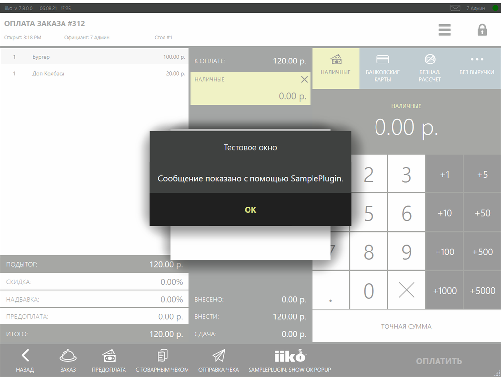
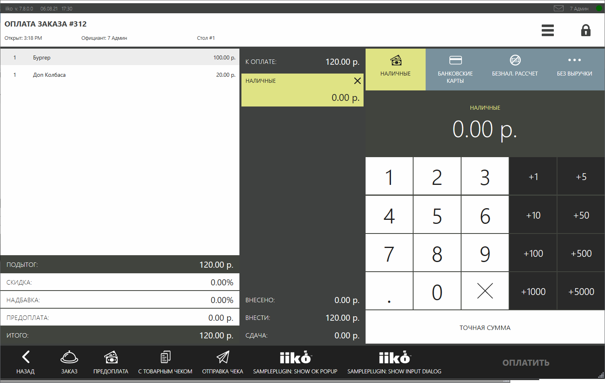
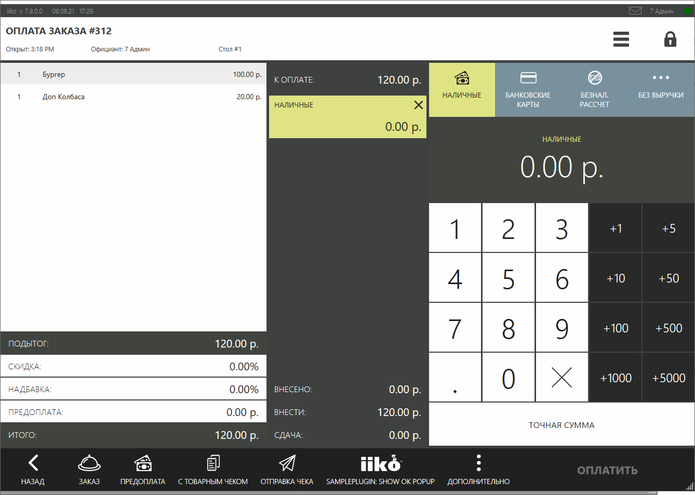
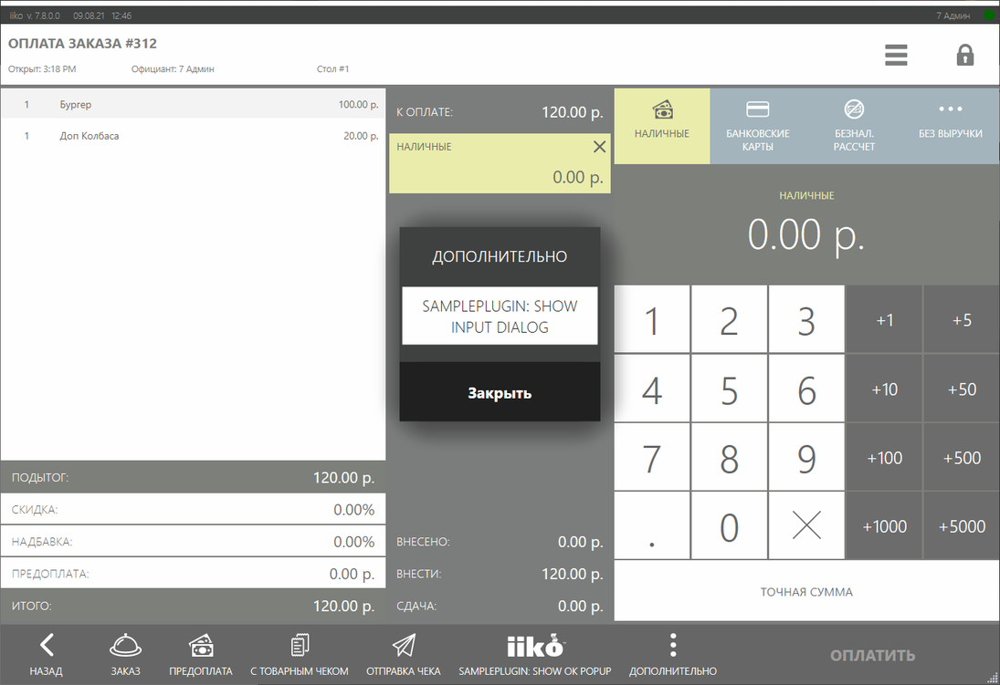

# Расширение функционала экрана кассы #

На экран кассы можно добавить кнопки, которые могут выполнять операции, используя объект текущего заказа, а также менять своё состояние.

## Как это выглядит в iikoFront?

Например, вот так выглядит кнопка *«SamplePlugin: Show OK popup»*, добавляемая плагином SamplePlugin из SDK.

 


Допустим, плагин показывает окно с сообщением (см. статью [*API диалоговые окна*](../../v6/ru/ViewManager.html "Диалоговые окна")).

 

Плагин может добавить сразу несколько кнопок на экран кассы.


Например, с помощью SDK SamplePlugin были добавлены 2 кнопки: *«SamplePlugin: Show OK popup»* и *«SamplePlugin: Show input dialog»*.




Может возникнуть ситуация, когда места под кнопки не хватает. Тогда вместо тех кнопок, которые не поместились, повится кнопка *«ДОПОЛНИТЕЛЬНО»*.

 

Если кнопка всего одна, то кнопка *«ДОПОЛНИТЕЛЬНО»* не появится в любом случае.

Разные плагины могут добавить свои кнопки.

По нажатию на кнопку *«ДОПОЛНИТЕЛЬНО»* будет выведен список всех непоместившихся кнопок.

 


## Как добавить свои расширения?

##### Шаг 1: Зарегистрировать обработчик для экрана кассы:
 
```cs
// Регистрация действия на экране кассы
subscription = PluginContext.Operations.AddButtonToPaymentScreen("SamplePlugin: Show ok popup", false, true, ShowOkPopupOnPaymentScreen);
``` 

Функция регистрации операции на экран кассы [`AddButtonToPaymentScreen()`](https://iiko.github.io/front.api.sdk/v7/html/M_Resto_Front_Api_IOperationService_AddButtonToPaymentScreen.htm) принимает на вход 5 аргументов:

- `string caption` — название кнопки, отображается на UI.
- `bool isChecked` — выделена ли кнопка.
- `bool isEnabled` — доступна ли кнопка для нажатия.
- `Action<(IOrder order, IOperationService os, IViewManager vm, (Guid buttonId, string caption, bool isChecked, string iconGeometry) state)> callback` - функция, которая будет вызвана при нажатии на кнопку.
- `string iconGeometry` — картинка кнопки (см. [`синтаксис`](https://docs.microsoft.com/en-us/dotnet/desktop/wpf/graphics-multimedia/path-markup-syntax?view=netframeworkdesktop-4.8)).

Функция нажатия на кнопку принимает объект заказа [`IOrder`](https://iiko.github.io/front.api.sdk/v7/html/T_Resto_Front_Api_Data_Orders_IOrder.htm), экземпляр [`IViewManager`](https://iiko.github.io/front.api.sdk/v7/html/T_Resto_Front_Api_UI_IViewManager.htm) для показа окон, а также текущее состояние кнопки - `(Guid buttonId, string caption, bool isChecked, string iconGeometry) state`.

##### Шаг 2. Описать обработчик добавляемой кнопки:

```cs
private void ShowOkPopupOnPaymentScreen((IOrder order, IOperationService os, IViewManager vm, (Guid buttonId, string caption, bool isChecked, string iconGeometry) state) info)
{ 
    info.vm.ShowOkPopup("Тестовое окно", "Сообщение показано с помощью SamplePlugin.");
}
```

Примеры реализации можно посмотреть в проекте SDK SamplePlugin в классе `ButtonsTester`.


## Как обновить состояние кнопки?

Можно в любой момент обновить состояние ранее добавленной кнопки с помощью функции [`UpdatePaymentScreenButtonState()`](https://iiko.github.io/front.api.sdk/v7/html/M_Resto_Front_Api_IOperationService_UpdatePaymentScreenButtonState.htm), которая принимает на вход 5 аргументов:

- `Guid buttonId` — идентификатор кнопки, который можно получить из вовращаемого значения функции [`AddButtonToPaymentScreen()`](https://iiko.github.io/front.api.sdk/v7/html/M_Resto_Front_Api_IOperationService_AddButtonToPaymentScreen.htm).
- `string caption` — необязательный аргумент. Если он задан, то обновится название кнопки.
- `bool? isChecked` — необязательный аргумент. Если он задан, то обновится состояние кнопки - выделена ли она или нет.
- `bool? isEnabled` — необязательный аргумент. Если он задан, то обновится состояние кнопки - доступна ли она для нажатия или нет.
- `string iconGeometry` — необязательный аргумент. Если он задан, то обновится картинка на кнопке.

Для отслеживания изменений на экране кассы, можно подписаться на событие [`PaymentScreenUpdated`](https://iiko.github.io/front.api.sdk/v7/html/P_Resto_Front_Api_INotificationService_PaymentScreenUpdated.htm). Событие вызывается при добавлении, изменении, удалении типа оплаты, при изменении суммы оплаты, а также при добавлении или удалении EInvoice. Это событие имеет 2 аргумента:

- `PaymentScreenUpdatedContext context` - текущее состояние экрана оплаты заказа.
- `IViewManager vm` - экземпляр [`IViewManager`](https://iiko.github.io/front.api.sdk/v7/html/T_Resto_Front_Api_UI_IViewManager.htm) для показа окон.
