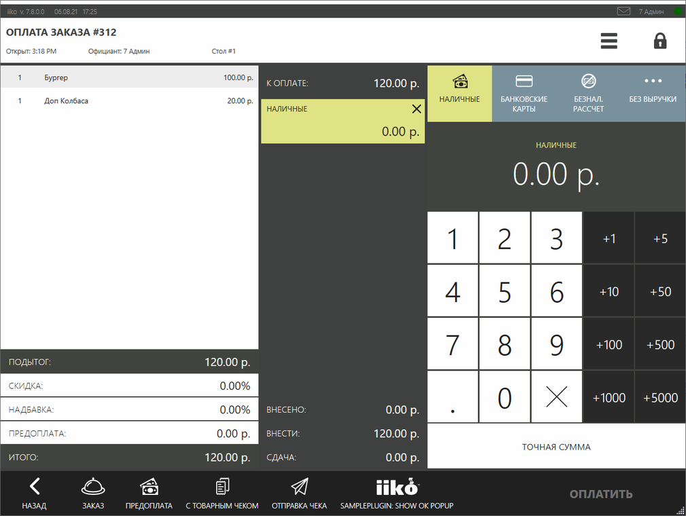
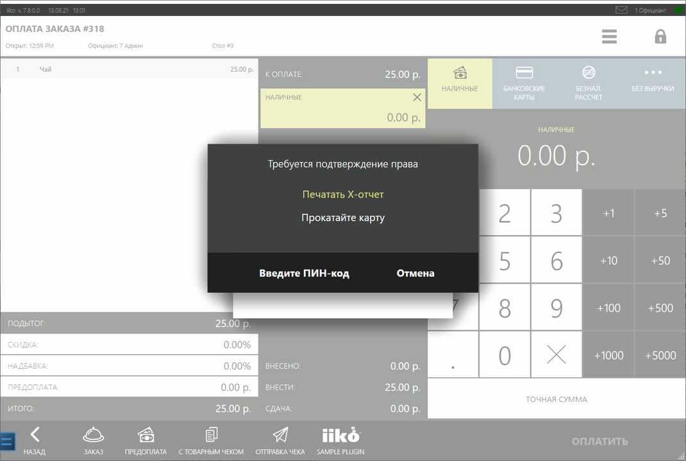

# Проверка и запрос прав #

Действия, которые выполняются с помощью плагина, могут требовать проверки или запроса прав. 
Для проверки прав пользователя есть методы [`CheckPermission`](https://iiko.github.io/front.api.sdk/v7/html/M_Resto_Front_Api_IOperationService_CheckPermission.htm) и [`CheckPermissions`](https://iiko.github.io/front.api.sdk/v7/html/M_Resto_Front_Api_IOperationService_CheckPermissions.htm). Д
ля запроса прав можно показать диалоговые окна с помощью методов [`ShowCheckPermissionPopup`](https://iiko.github.io/front.api.sdk/v7/html/M_Resto_Front_Api_UI_IViewManager_ShowCheckPermissionPopup.htm) и [`ShowCheckPermissionsPopup`](https://iiko.github.io/front.api.sdk/v7/html/M_Resto_Front_Api_UI_IViewManager_ShowCheckPermissionsPopup.htm). 
Текущего пользователя можно узнать с помощью метода [`GetCurrentUser`](https://iiko.github.io/front.api.sdk/v7/html/M_Resto_Front_Api_IOperationService_GetCurrentUser.htm). 
Если терминал работает в режиме "Строгое соответствие расписанию", то текущую роль можно узнать с помощью [`GetStrictAccordanceToScheduleUserRole`](https://iiko.github.io/front.api.sdk/v7/html/M_Resto_Front_Api_IOperationService_GetStrictAccordanceToScheduleUserRole.htm).

## Как это выглядит в iikoFront?

Например, плагин добавляет кнопку *«SamplePlugin: Show OK popup»* на «[экран кассы](ActionOnPaymentScreenView.html)». 
Пример реализации можно посмотреть в проекте SDK SamplePlugin в классе `ButtonsTester`.



Пусть кнопка будет доступна для нажатия только пользователям с определёнными правами. 
Это можно сделать несколькими способами. 
Для начала зарегистрируем кнопку:

```cs
// Регистрация действия на экране кассы
subscription = PluginContext.Operations.AddButtonToPaymentScreen("SamplePlugin: Show ok popup", false, true, ShowOkPopupOnPaymentScreen);
``` 

В результате выполнения метода регистрации можно получить идентификатор кнопки - `subscription.buttonId`. 
В дальнейшем будет использоваться этот идентификатор.

### Вариант 1: Отключение кнопки для всех пользователей, у кого нет права на её нажатие.

Можно включать и выключать ранее добавленную кнопку на экран кассы с помощью метода [`UpdatePaymentScreenButtonState`](https://iiko.github.io/front.api.sdk/v7/html/M_Resto_Front_Api_IOperationService_UpdatePaymentScreenButtonState.htm), передавая параметр *isEnabled*. 
Здесь удобнее всего будет воспользоваться событием [`CurrentUserChanged`](https://iiko.github.io/front.api.sdk/v7/html/P_Resto_Front_Api_INotificationService_CurrentUserChanged.htm), чтобы узнать, какой пользователь сейчас работает.
Подпишемся на событие и проверим, обладает ли пользователь нужным правом (например, право печати Х-отчёта "F_XR"):

```cs
// Подписка на событие изменения текущего пользователя
PluginContext.Notifications.CurrentUserChanged.Where(user => user != null).DistinctUntilChanged().Subscribe(user =>
{
    var isButtonEnabled = PluginContext.Operations.CheckPermission(user, "F_XR");
    PluginContext.Operations.UpdatePaymentScreenButtonState(subscription.buttonId, isEnabled: isButtonEnabled);
});
``` 

Таким образом, при изменении текущего пользователя, в зависимости от наличия права "F_XR", кнопка будет выключаться или включаться.
Метод [`CheckPermission`](https://iiko.github.io/front.api.sdk/v7/html/M_Resto_Front_Api_IOperationService_CheckPermission.htm) принимает на вход 3 аргумента:

- [`IUser`](https://iiko.github.io/front.api.sdk/v7/html/T_Resto_Front_Api_Data_Security_IUser.htm) `user` — пользователь, для которого проверяется право.
- `string permissionCode` — право, которое должно быть у пользователя. 
- [`IRole`](https://iiko.github.io/front.api.sdk/v7/html/T_Resto_Front_Api_Data_Security_IRole.htm) `role` — необязательный параметр. Роль пользователя. Используется, если терминал работает в режиме "Строгое соответствие расписанию", можно получить с помощью метода [`GetStrictAccordanceToScheduleUserRole`](https://iiko.github.io/front.api.sdk/v7/html/M_Resto_Front_Api_IOperationService_GetStrictAccordanceToScheduleUserRole.htm).

Точно так же можно проверить несколько прав, воспользовавшись методом [`CheckPermissions`](https://iiko.github.io/front.api.sdk/v7/html/M_Resto_Front_Api_IOperationService_CheckPermissions.htm). Он принимает на вход 4 аргумента:

- [`IUser`](https://iiko.github.io/front.api.sdk/v7/html/T_Resto_Front_Api_Data_Security_IUser.htm) `user` — пользователь, для которого проверяются права.
- `string[] permissionCodes` — права, которые проверяются у пользователя.
- [`PermissionsCheckMode`](https://iiko.github.io/front.api.sdk/v7/html/T_Resto_Front_Api_PermissionsCheckMode.htm) `checkMode` - проверять наличие всех прав (`PermissionsCheckMode.All`), или хотя бы одного (`PermissionsCheckMode.Any`).
- [`IRole`](https://iiko.github.io/front.api.sdk/v7/html/T_Resto_Front_Api_Data_Security_IRole.htm) `role` — необязательный параметр. Роль пользователя. Используется, если терминал работает в режиме "Строгое соответствие расписанию".

Список прав, которыми обладает пользователь, может поменяться. 
Для отслеживания этого, можно подписаться на событие [`UserChanged`](https://iiko.github.io/front.api.sdk/v7/html/P_Resto_Front_Api_INotificationService_UserChanged.htm).

### Вариант 2: Скрытие кнопки для всех пользователей, у кого нет права на её нажатие.

Можно перенести регистрацию кнопки в подписку [`CurrentUserChanged`](https://iiko.github.io/front.api.sdk/v7/html/P_Resto_Front_Api_INotificationService_CurrentUserChanged.htm):

```cs
(Guid buttonId, IDisposable buttonRegistration)? subscription = null;
// Подписка на событие изменения текущего пользователя
PluginContext.Notifications.CurrentUserChanged.Where(user => user != null).DistinctUntilChanged().Subscribe(user =>
{
    if (PluginContext.Operations.CheckPermission(user, "F_XR")) //Пользователь обладает правом
    {
        if(subscription == null) //Была ли ранее создана кнопка
            subscription = PluginContext.Operations.AddButtonToPaymentScreen("SamplePlugin: Show ok popup", false, true, ShowOkPopupOnPaymentScreen);
    }
    else //Пользователь не обладает правом
    {
        subscription?.buttonRegistration.Dispose(); //Удаляем кнопку, если она была создана
        subscription = null;
    }
});
``` 

В этом случае, если у пользователя нет права, то кнопка не покажется.

### Вариант 3: Проверка возможности выполнения операции в момент нажатия на кнопку.

Если есть возможность воспользоваться экземпляром [`IViewManager`](https://iiko.github.io/front.api.sdk/v7/html/T_Resto_Front_Api_UI_IViewManager.htm), то можно показать окно запроса прав. 
Например, доступ к нему есть в подписке на событие нажатия на кнопку. 
Здесь может быть несколько вариантов реализации.

#### Вариант 3.1: Если право у пользователя есть, то окно запроса права не покажется. Если у пользователя его нет, то показываем окно запроса права. 

```cs
private void ShowOkPopupOnPaymentScreen((IOrder order, IOperationService os, IViewManager vm, (Guid buttonId, string caption, bool isChecked, string iconGeometry) state) info)
{
    if(info.vm.ShowCheckPermissionPopup("F_XR", false) == null) //Право не было подтверждено
        return;
    info.vm.ShowOkPopup("Тестовое окно", "Сообщение показано с помощью SamplePlugin.");
}
```

Метод [`ShowCheckPermissionPopup`](https://iiko.github.io/front.api.sdk/v7/html/M_Resto_Front_Api_UI_IViewManager_ShowCheckPermissionPopup.htm) принимает на вход 2 аргумента:

- `string permissionCode` — право, которое должно быть у текущего пользователя.
- `bool showConfirmPopupAnyway` — если false, то окно покажется только в том случае, если у текущего пользователя нет права. Если true, то окно покажется в любом случае, даже если пользователь обладает нужным правом.

Метод возвращает экземпляр [`IUser`](https://iiko.github.io/front.api.sdk/v7/html/T_Resto_Front_Api_Data_Security_IUser.htm) - пользователь, который подтвердил право, либо *null*, если право не было подтверждено. 
Следует учитывать, что подтвердить право может любой пользователь, а не только тот, кто в данный момент выполнил вход в терминал.

В нашем случае, если текущий пользователь обладает правом, то окно запроса прав не покажется, произойдёт выполнение операции. 
Если же права у него нет, то покажется окно запроса прав:



Если право было подтверждено, то метод [`ShowCheckPermissionPopup`](https://iiko.github.io/front.api.sdk/v7/html/M_Resto_Front_Api_UI_IViewManager_ShowCheckPermissionPopup.htm) вернёт экземпляр [`IUser`](https://iiko.github.io/front.api.sdk/v7/html/T_Resto_Front_Api_Data_Security_IUser.htm) - пользователя, который подтвердил права.

#### Вариант 3.2: Запрашивать право в любом случае, даже если у пользователя оно есть.

Иногда непреднамеренное выполнение операции может привести к нежелательным последствиям.
Для этого можно требовать подтверждения права, даже если текущий пользователь им уже обладает.
Переделаем подписку нажатия на кнопку, передав в `showConfirmPopupAnyway` `true`:

```cs
private void ShowOkPopupOnPaymentScreen((IOrder order, IOperationService os, IViewManager vm, (Guid buttonId, string caption, bool isChecked, string iconGeometry) state) info)
{
    if(info.vm.ShowCheckPermissionPopup("F_XR", true) == null) //Право не было подтверждено
        return;
    info.vm.ShowOkPopup("Тестовое окно", "Сообщение показано с помощью SamplePlugin.");
}
```

В этом случае окно запроса прав будет показываться всегда.

### Вариант 4: Проверка нескольких прав.

Можно показать окно проверки нескольких прав, например:

```cs
private void ShowOkPopupOnPaymentScreen((IOrder order, IOperationService os, IViewManager vm, (Guid buttonId, string caption, bool isChecked, string iconGeometry) state) info)
{
    if (info.vm.ShowCheckPermissionsPopup(new string[] { "F_XR", "F_ZREP" }, false, PermissionsCheckMode.Any) == null) //Права не были подтверждены
        return;
    info.vm.ShowOkPopup("Тестовое окно", "Сообщение показано с помощью SamplePlugin.");
}
```

Метод [`ShowCheckPermissionsPopup`](https://iiko.github.io/front.api.sdk/v7/html/M_Resto_Front_Api_UI_IViewManager_ShowCheckPermissionsPopup.htm) принимает на вход 3 аргумента:

- `string[] permissionCodes` — права, которое будут проверяться у текущего пользователя.
- `bool showConfirmPopupAnyway` — если false, то окно покажется только в том случае, если у текущего пользователя нет прав. Если true, то окно покажется в любом случае, даже если пользователь обладает нужным правом.
- [`PermissionsCheckMode`](https://iiko.github.io/front.api.sdk/v7/html/T_Resto_Front_Api_PermissionsCheckMode.htm) `checkMode` - проверять наличие всех прав (`PermissionsCheckMode.All`), или хотя бы одного (`PermissionsCheckMode.Any`).

Метод возвращает экземпляр [`IUser`](https://iiko.github.io/front.api.sdk/v7/html/T_Resto_Front_Api_Data_Security_IUser.htm) - пользователь, который подтвердил права, либо `null`, если права не были подтверждены.