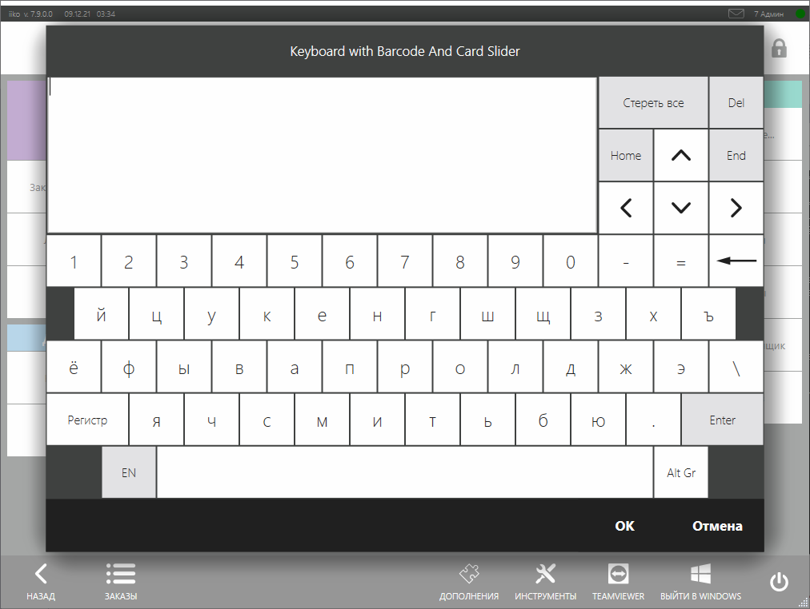

# Диалог ввода строк и штрихкодов #

Плагины могут запрашивать данные (строки, штрихкоды, карты) у пользователя с помощью диалоговых окон.
Здесь мы будем рассматривать диалог [`IViewManager.ShowExtendedKeyboardDialog`](https://iiko.github.io/front.api.sdk/v7/html/M_Resto_Front_Api_UI_IViewManager_ShowExtendedKeyboardDialog.htm), но есть и другие диалоги, о которых можно прочитать в статье [Диалоговые окна]({{ site.baseurl }}/v6/ru/ViewManager.html).

## Как это выглядит в iikoFront?

Диалог ввода строк можно показать везде, где доступен [`IViewManager`](https://iiko.github.io/front.api.sdk/v7/html/T_Resto_Front_Api_UI_IViewManager.htm).
В плагине [`Resto.Front.Api.SamplePlugin`](https://github.com/iiko/front.api.sdk/tree/master/sample/v7preview7/Resto.Front.Api.SamplePlugin) в классе [`ButtonsTester`](https://github.com/iiko/front.api.sdk/blob/master/sample/v7preview7/Resto.Front.Api.SamplePlugin/ButtonsTester.cs) есть пример его показа по клику на кнопку `SamplePlugin: Show extended keyboard view`:



Далее в статье будем использовать именно этот подход — показ окна ввода строки при нажатии на кнопку.

Диалог поддерживает следующие типы ввода:
- произвольная строка.
- скрытая строка.
- считывание штрихкода.
- считывание карты.

Диалог принимает на вход 8 параметров:
- `string title` - заголовок диалога.
- `string initialText` - необязательный параметр.
Строка, которая будет введена при показе диалога.
По умолчанию `String.Empty`.
- `bool isMultiline` - необязательный параметр.
Позволяет вводить многострочный текст.
Игнорируется при выставленном параметре `isPassword = true`.
По умолчанию `true`.
- `int maxLength` - необязательный параметр.
Максимальная длина строки.
По умолчанию `Int32.MaxValue`.
- `bool capitalize` - необязательный параметр.
Писать ли слова автоматически с заглавной буквы.
Игнорируется, если параметр `isPassword` равен `true`.
По умолчанию `false`.
- `bool isPassword` - необязательный параметр.
Скрывать ли строку при вводе.
По умолчанию `false`.
Игнорируется, если параметры `isMultiline` и `capitalize` равны `true`.
- `bool enableCardSlider` - необязательный параметр.
Возможно ли вводить данные с помощью прокатки карты.
По умолчанию `false`.
- `bool enableBarcode` - необязательный параметр.
Возможно ли вводить данные с помощью считывания штрихкода.
По умолчанию `false`.

### Ввод произвольной строки

На ввод произвольной строки оказыают влияние параметры `initialText`, `isMultiline` и `capitalize`.
Например, запретим многострочный ввод, введённая строка будет начинаться с заглавной буквы:

```cs
PluginContext.Operations.AddButtonToPluginsMenu("SamplePlugin: String input example", x =>
{
    var inputResult = x.vm.ShowExtendedKeyboardDialog("String input example", isMultiline: false, capitalize: true);
});
```

При таких параметрах диалог будет реагировать только на ввод с клавиатуры.
Сканирование штрихкода и прокатка карты не будут учитываться. Все слова будут вводиться с заглавной буквы.
Это может быть полезно при вводе имени, фамилии и отчества.

Полученный результат необходимо привести к типу [`StringInputDialogResult`](https://iiko.github.io/front.api.sdk/v7/html/T_Resto_Front_Api_Data_View_StringInputDialogResult.htm).
Дополним код:

```cs
PluginContext.Operations.AddButtonToPluginsMenu("SamplePlugin: String input example", x =>
{
    var inputResult = x.vm.ShowExtendedKeyboardDialog("String input example", isMultiline: false, capitalize: true);
    var strResult = inputResult as StringInputDialogResult;
    if (strResult == null)
        return; //Пользователь нажал "Отмена"
    var result = strResult.Result; //Введённый пользователем текст
});
```

### Ввод скрытой строки

Можно скрыть введённую строку с помощью параметра `isPassword`:

```cs
PluginContext.Operations.AddButtonToPluginsMenu("SamplePlugin: Password input example", x =>
{
    var inputResult = x.vm.ShowExtendedKeyboardDialog("Password input example", isPassword: true);
    var strResult = inputResult as StringInputDialogResult;
    if (strResult == null)
        return; //Пользователь нажал "Отмена"
    var result = strResult.Result; //Введённый пользователем скрытый текст
});
```

Как было написано выше, параметры `isMultiline` и `capitalize` не будут учитываться.
Однако, остается возможность передать `true` в параметры `enableCardSlider` и `enableBarcode`, что позволит прокатывать карту и сканировать штрих-код.

### Считывание карт

Можно отследить считывание карты с помощью параметра `enableCardSlider`.
Результат необходимо привести к типу [`CardInputDialogResult`](https://iiko.github.io/front.api.sdk/v7/html/T_Resto_Front_Api_Data_View_CardInputDialogResult.htm):

```cs
PluginContext.Operations.AddButtonToPluginsMenu("SamplePlugin: Card input example", x =>
{
    var inputResult = x.vm.ShowExtendedKeyboardDialog("Card input example", enableCardSlider: true);
    var cardResult = inputResult as CardInputDialogResult;
    if (cardResult == null)
        return; //Пользователь нажал "Отмена", либо был другой тип ввода
    var result = cardResult.FullCardTrack; //Полная информация о карте
});
```

Запретить ввод через клавиатуру при этом нельзя.

### Сканирование штрихкода

Можно отследить сканирование штрихкода с помощью параметра `enableBarcode`.
При этом сканирование сервисных штрихкодов не будет учитываться.
Результат необходимо привести к типу [`BarcodeInputDialogResult`](https://iiko.github.io/front.api.sdk/v7/html/T_Resto_Front_Api_Data_View_BarcodeInputDialogResult.htm):

```cs
PluginContext.Operations.AddButtonToPluginsMenu("SamplePlugin: Barcode input example", x =>
{
    var inputResult = x.vm.ShowExtendedKeyboardDialog("Barcode input example", enableBarcode: true);
    var barcodeResult = inputResult as BarcodeInputDialogResult;
    if (barcodeResult == null)
        return; //Пользователь нажал "Отмена", либо был другой тип ввода
    var result = barcodeResult.Barcode; //Считанный штрихкод
});
```

### Смешанный ввод

Пусть наш диалог будет работать и с вводом текста, и с штрихкодами, и с картами.
Тогда нужно правильно обработать результат ввода.
В `SamplePlugin` есть пример такого подхода.
Модифицируем наш код для поддержки всех типов ввода:

```cs
PluginContext.Operations.AddButtonToPluginsMenu("SamplePlugin: Mixed input example", x =>
{
    var inputResult = x.vm.ShowExtendedKeyboardDialog("Mixed input example", enableCardSlider: true, enableBarcode: true);
    switch (inputResult)
    {
        case StringInputDialogResult stringInputDialogResult:
            var strResult = stringInputDialogResult.Result; //Введённый пользователем текст
            return;
        case CardInputDialogResult cardInputDialogResult:
            var cardResult = cardInputDialogResult.FullCardTrack; //Полная информация о карте
            return;
        case BarcodeInputDialogResult barcodeInputDialogResult:
            var barcodeResult = barcodeInputDialogResult.Barcode; //Считанный штрихкод
            return;
        default:
            return; //Пользователь нажал "Отмена"
    }
});
```