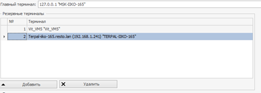

В версии V8Preview6 введена возможность контролирования состояния главного терминала(ГТ) группы и при необходимости передачи этой роли другому терминалу.

Нововведение состоит из следующих элементов:

1.	Список резервных терминалов;
2.	Отслеживание состояния главного терминала;
3.	Возможность перенастраивать главный терминал через API.

Подробнее:

1) В приложении iikoOffice в Настройках торгового предприятия => настройках группы можно задавать список резервных терминалов. Эти терминалы будут являться запасными терминалами, которые смогут принять на себя роль ГТ если это  будет необходимо. Форма для задания резервных терминалов выглядит следующим образом:



В API в интерфейс [`ITerminalsGroup`](https://iiko.github.io/front.api.sdk/v8/html/T_Resto_Front_Api_Data_Organization_ITerminalsGroup.htm ) добавлен список [`StandbyTerminals`](https://iiko.github.io/front.api.sdk/v8/html/P_Resto_Front_Api_Data_Organization_ITerminalsGroup_StandbyTerminals.htm), который и содержит список резервных терминалов, заданных в iikoOffice. Чтобы получить информацию о текущей группе терминалов можно воспользоваться методом [`GetHostTerminalsGroup`](https://iiko.github.io/front.api.sdk/v8/html/M_Resto_Front_Api_IOperationService_GetHostTerminalsGroup.htm) или же подписаться на нотификацию [`TerminalsGroupChanged`](https://iiko.github.io/front.api.sdk/v8/html/P_Resto_Front_Api_INotificationService_TerminalsGroupChanged.htm).

2) Каждый ведомый терминал (ВТ) отслеживает состояние соединения с ГТ и если состояние изменится, то терминал сообщит об этом. Для этого была добавлена новая нотификация [`ConnectionToMainTerminalChanged`](https://iiko.github.io/front.api.sdk/v8/html/P_Resto_Front_Api_INotificationService_ConnectionToMainTerminalChanged.htm). В этой нотификации передается состояние связи: true - соединение с ГТ установлено, false - соединение с ГТ потеряно.

3) В API введена новая операция [`ChangeGroupMainTerminal`](https://iiko.github.io/front.api.sdk/v8/html/M_Resto_Front_Api_IOperationService_ChangeGroupMainTerminal.htm), позволяющая менять ГТ. Для выполнения данной операция необходимо иметь право на проведение опасных операций([`F_DOP`](https://ru.iiko.help/articles/#!iikooffice-8-3/topic-745/q/%25D0%25BE%25D0%25BF%25D0%25B0%25D1%2581%25D0%25BD%25D1%258B%25D0%25B5%2520%25D0%25BE%25D0%25BF%25D0%25B5%25D1%2580%25D0%25B0%25D1%2586%25D0%25B8%25D0%25B8/qid/1738593/qp/1)) и передавать в качестве аргумента терминал, который является резервным. После выполнения данной операции переданный терминал становится ГТ, а бывший ГТ переходит в список резервных терминалов.


Пример:
```cs
private static void ChangeGroupMainTerminal(IOperationService os)
{
	var newMainTerminal = os.GetHostTerminalsGroup().StandbyTerminals.First();
	os.ChangeGroupMainTerminal(os.GetCredentials(),newMainTerminal);
}
```

На данный момент для пользования этим нововведением необходимо иметь лицензию 21053302. Также данная лицензия убирает 30-секундную задержку при перезагрузке iikoFront.