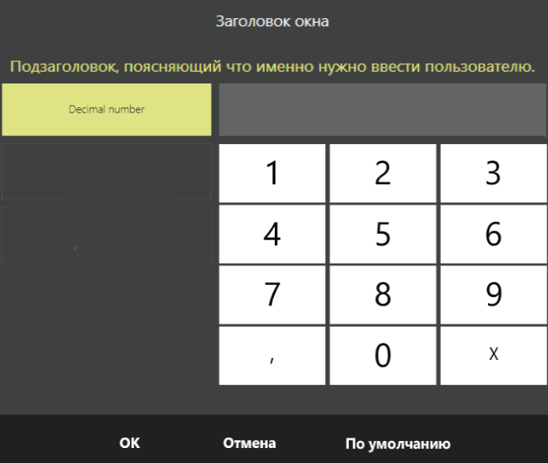

### Диалог ввода числовых строк
Начиная с версии V8, изменена структура класса настроек - [`ExtendedInputDialogSettings`](https://iiko.github.io/front.api.sdk/v8/html/T_Resto_Front_Api_UI_ExtendedInputDialogSettings.htm), который передается в качестве параметра в [`Диалоговое окно`](https://kmamedkulyev.github.io/front.api.doc/v6/ru/ViewManager.html) - [`ShowExtendedInputDialog()`](https://iiko.github.io/front.api.sdk/v8/html/M_Resto_Front_Api_UI_IViewManager_ShowExtendedInputDialog.htm).

[`ExtendedInputDialogSettings.EnableNumericString`](https://iiko.github.io/front.api.sdk/v7/html/P_Resto_Front_Api_UI_ExtendedInputDialogSettings_EnableNumericString.htm) заменен на [`NumericInputMode`](https://iiko.github.io/front.api.sdk/v8/html/T_Resto_Front_Api_UI_NumericInputMode.htm) который является типом `enum` состоящий из:
- [`Disabled`](https://iiko.github.io/front.api.sdk/v8/html/T_Resto_Front_Api_UI_NumericInputMode.htm) - значение по умолчанию, если не указан тип ввода.
- [`String`](https://iiko.github.io/front.api.sdk/v8/html/T_Resto_Front_Api_UI_NumericInputMode.htm) - ввод целых чисел.
- [`Decimal`](https://iiko.github.io/front.api.sdk/v8/html/T_Resto_Front_Api_UI_NumericInputMode.htm) - ввод дробных чисел.
 
Для типа ввода дробных чисел [`Decimal`](https://iiko.github.io/front.api.sdk/v8/html/T_Resto_Front_Api_UI_NumericInputMode.htm) добавлены свойства:
- [`MaxDecimalValue`](https://iiko.github.io/front.api.sdk/v8/html/P_Resto_Front_Api_UI_ExtendedInputDialogSettings_MaxDecimalValue.htm) - максимальное значение.
- [`MinDecimalValue`](https://iiko.github.io/front.api.sdk/v8/html/P_Resto_Front_Api_UI_ExtendedInputDialogSettings_MinDecimalValue.htm) - минимальное значение.
- [`DefaultDecimalValue`](https://iiko.github.io/front.api.sdk/v8/html/P_Resto_Front_Api_UI_ExtendedInputDialogSettings_DefaultDecimalValue.htm) - значение по умолчанию.

С помощью новых свойств можно задавать соответствующие ограничения для дробных чисел. 

При выборе `String` или `Decimal` пользователю будет предложено ввести целые числа или числа с дробью. 
В качестве поясняющего текста по дробным числам используется [`ExtendedInputDialogSettings.TabTitleNumericString`](https://iiko.github.io/front.api.sdk/v8/html/P_Resto_Front_Api_UI_ExtendedInputDialogSettings_TabTitleNumericString.htm).



Пример:
```cs
var settings = new ExtendedInputDialogSettings
{
    NumericInputMode = NumericInputMode.Decimal,
    TabTitleNumericString = "Заголовок вкладки для ввода дробных числа",
    MaxDecimalValue = 500,
    DefaultDecimalValue = 50
}

var dialogResult = viewManager.ShowExtendedInputDialog(
                "Заголовок окна", 
                "Подзаголовок, поясняющий что именно нужно ввести пользователю.",
                settings) 
    as NumericStringInputDialogResult;
if (dialogResult == null)
    return;
// analyze result
```